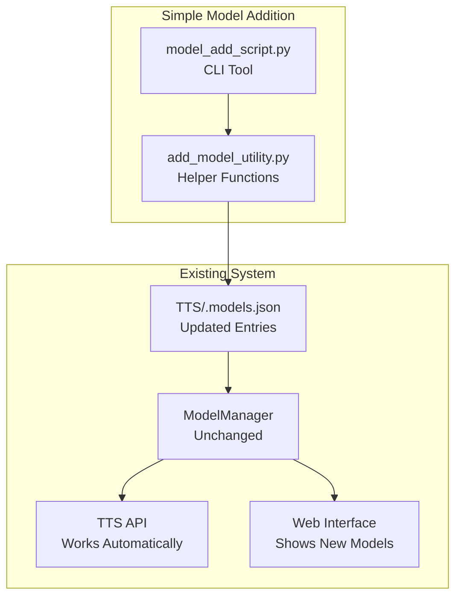

# adding-new-models - Task 11.2

Execute task 11.2 for the adding-new-models specification.

## Task Description
Add setup method to create temporary registry file

## Usage
```
/Task:11.2-adding-new-models
```

## Instructions

Execute with @spec-task-executor agent the following task: "Add setup method to create temporary registry file"

```
Use the @spec-task-executor agent to implement task 11.2: "Add setup method to create temporary registry file" for the adding-new-models specification and include all the below context.

# Steering Context
## Steering Documents Context (Pre-loaded)

### Product Context
# Product Vision - Coqui TTS

## Product Overview
Coqui TTS is an advanced Text-to-Speech library that democratizes high-quality speech synthesis through open-source technology. As a maintained fork of the original Coqui AI project, it provides researchers, developers, and enthusiasts with cutting-edge TTS capabilities.

## Core Mission
Enable anyone to create natural, expressive speech synthesis with minimal technical barriers while advancing the state of the art in TTS research.

## Target Users

### Primary Users
- **AI Researchers**: Need flexible TTS models for speech research and experimentation
- **Application Developers**: Integrate TTS into applications, games, assistive technology
- **Content Creators**: Generate voiceovers, audiobooks, and multimedia content
- **Accessibility Teams**: Build tools for visually impaired and reading-disabled users

### Secondary Users
- **Educators**: Create educational content and language learning materials
- **Hobbyists**: Experiment with voice cloning and synthesis
- **Enterprise Teams**: Custom voice solutions for products and services

## Key Features

### Core Capabilities
- **1100+ Pre-trained Models**: Multi-language, multi-speaker models ready to use
- **Voice Cloning**: Create custom voices from 5-30 seconds of audio
- **Real-time Synthesis**: Streaming TTS with <200ms latency (XTTS)
- **Multi-language Support**: 17+ languages with automatic detection
- **Model Training**: Tools to train custom models on any dataset

### Advanced Features
- **Voice Conversion**: Convert speech between different speakers
- **Neural Vocoders**: High-quality audio generation (HiFiGAN, WaveGrad)
- **Streaming Support**: Real-time audio generation for interactive applications
- **Model Comparison**: Side-by-side evaluation of different TTS approaches

## Business Objectives

### Open Source Goals
1. **Community Growth**: Expand the TTS research and development community
2. **Research Advancement**: Push the boundaries of speech synthesis quality
3. **Accessibility**: Make TTS technology accessible globally
4. **Innovation**: Enable new applications through easy-to-use APIs

### Technical Objectives
1. **Performance**: Maintain state-of-the-art synthesis quality
2. **Usability**: Provide intuitive APIs for both research and production
3. **Scalability**: Support from single-user to enterprise deployments
4. **Reliability**: Ensure consistent, reproducible results

## Success Metrics

### Community Metrics
- GitHub stars, forks, and contributions
- PyPI download statistics
- Community discussions and support requests
- Research papers citing the project

### Technical Metrics
- Model quality scores (MOS, similarity metrics)
- Synthesis speed and latency measurements
- Memory usage and computational efficiency
- Cross-platform compatibility

### User Experience Metrics
- Time to first successful synthesis
- Documentation clarity and completeness
- Error rates and debugging ease
- Feature adoption rates

## Product Roadmap Priorities

### Short-term (Next 3 months)
- Enhanced web interface with advanced controls
- Improved model management and caching
- Better mobile and responsive design
- Performance optimizations

### Medium-term (3-12 months)
- New model architectures and improvements
- Expanded language support
- Advanced voice cloning features
- Integration with popular development frameworks

### Long-term (1+ years)
- Real-time conversation synthesis
- Emotional and style control
- Multi-modal synthesis (speech + visual)
- Edge deployment optimizations

---

### Technology Context
# Technology Stack - Coqui TTS

## Architecture Overview
Coqui TTS follows a modular architecture separating TTS models, vocoders, voice conversion, and serving infrastructure. The system supports both research experimentation and production deployment.

## Core Technologies

### Machine Learning Stack
- **PyTorch 2.1+**: Primary deep learning framework
- **TorchAudio**: Audio processing and feature extraction
- **NumPy 1.26+**: Numerical computations and array operations
- **SciPy**: Scientific computing and signal processing
- **Transformers 4.52.1+**: Pre-trained transformer models (Bark, XTTS)

### Audio Processing
- **LibROSA 0.11+**: Audio analysis and feature extraction
- **SoundFile**: Audio I/O operations
- **Cython 3.0+**: Performance-critical audio processing
- **Encodec**: Neural audio codec for compression

### Backend Services
- **FastAPI**: Modern async web framework for REST APIs
- **Uvicorn**: ASGI server with WebSocket support
- **Pydantic**: Data validation and API documentation
- **Python Multipart**: File upload handling

### Frontend Technologies
- **React 18**: UI framework with concurrent features
- **TypeScript 5.9+**: Type-safe JavaScript development
- **Vite 7.1+**: Build tool and development server
- **Jest 29**: Testing framework with JSDOM

### Development Tools
- **Ruff 0.9.1**: Fast Python linter and formatter
- **Pre-commit**: Git hooks for code quality
- **GitHub Actions**: CI/CD pipeline automation
- **Docker**: Containerization for development and deployment

## Model Architectures

### Text-to-Speech Models
- **XTTS v2**: GPT-based with streaming support, 17 languages
- **VITS**: Variational inference with normalizing flows
- **Bark**: Transformer-based generative model with non-speech sounds
- **Tortoise**: Autoregressive model for high-quality synthesis
- **Tacotron/Tacotron2**: Sequence-to-sequence with attention
- **GlowTTS**: Flow-based parallel synthesis
- **FastSpeech/FastSpeech2**: Non-autoregressive parallel synthesis

### Vocoders
- **HiFiGAN**: High-fidelity generative adversarial vocoder
- **WaveGrad**: Diffusion-based vocoder
- **MelGAN/MultibandMelGAN**: Lightweight GAN vocoders
- **WaveRNN**: Recurrent neural vocoder
- **UnivNet**: Universal vocoder

### Voice Conversion
- **FreeVC**: Any-to-any voice conversion
- **OpenVoice v1/v2**: Cross-lingual voice cloning
- **kNN-VC**: k-nearest neighbors voice conversion

## Technical Constraints

### Performance Requirements
- **Synthesis Speed**: Real-time factor < 1.0 for interactive use
- **Memory Usage**: Support systems with 4GB+ RAM
- **Latency**: <200ms for streaming synthesis (XTTS)
- **Quality**: MOS scores > 4.0 for natural speech

### Compatibility Requirements
- **Python**: 3.10, 3.11, 3.12 support
- **Platforms**: Linux (primary), macOS, Windows
- **Hardware**: CPU-only and GPU acceleration (CUDA, MPS)
- **Browsers**: Modern browsers for web interface

### Scalability Constraints
- **Model Size**: Balance quality vs. deployment size
- **Concurrent Users**: Support multiple simultaneous synthesis requests
- **Resource Management**: Efficient model loading and memory management

## Third-party Integrations

### Language Processing
- **Gruut**: Grapheme-to-phoneme conversion (German, Spanish, French)
- **espeak-ng**: Phonemization for multiple languages
- **Fairseq MMS**: 1100+ language models from Meta
- **Language-specific G2P**: Specialized processors for Bengali, Japanese, Korean, Chinese

### Model Distribution
- **Hugging Face Hub**: Model hosting and distribution
- **PyPI**: Package distribution
- **GitHub Releases**: Binary distributions and assets

### Audio Libraries
- **Monotonic Alignment Search**: Attention alignment optimization
- **Coqui TTS Trainer**: Training utilities and abstractions
- **Coqpit Config**: Configuration management

## Technical Decisions

### Framework Choices
- **PyTorch over TensorFlow**: Better research flexibility and dynamic graphs
- **FastAPI over Flask**: Modern async support and automatic documentation
- **React over Vue/Angular**: Large ecosystem and concurrent features
- **TypeScript over JavaScript**: Type safety for complex UI interactions

### Architecture Patterns
- **Modular Design**: Separate concerns for models, vocoders, and serving
- **Plugin Architecture**: Easy addition of new models and languages
- **Async Processing**: Non-blocking synthesis for web interface
- **Caching Strategy**: Intelligent model and result caching

### Quality Assurance
- **Type Checking**: MyPy for Python, TypeScript for frontend
- **Testing Strategy**: Unit, integration, and model validation tests
- **Code Quality**: Ruff linting with strict rules
- **Documentation**: Automated API docs with examples

## Performance Optimizations

### Model Optimization
- **ONNX Export**: Optimized inference for production
- **Quantization**: Reduced precision for faster inference
- **Model Pruning**: Remove unnecessary parameters
- **Batch Processing**: Efficient multi-request handling

### System Optimization
- **Memory Pooling**: Reuse audio buffers and tensors
- **Model Sharing**: Single model instance for multiple requests
- **Background Loading**: Preload commonly used models
- **Resource Monitoring**: Track GPU/CPU usage and memory

## Security Considerations

### Data Protection
- **No Persistent Storage**: Audio uploads not stored permanently
- **Input Validation**: Strict validation of audio and text inputs
- **Rate Limiting**: Prevent abuse of synthesis endpoints
- **CORS Configuration**: Secure cross-origin requests

### Deployment Security
- **Container Security**: Minimal base images and security scanning
- **Environment Isolation**: Separate development and production configs
- **Dependency Management**: Regular security updates
- **Access Control**: Authentication for administrative functions

---

### Structure Context
# Project Structure - Coqui TTS

## Directory Organization

### Root Level Structure
```
coqui-ai-TTS/
├── TTS/                    # Main package directory
├── docs/                   # Sphinx documentation
├── tests/                  # Test suites
├── recipes/                # Training recipes for different datasets
├── notebooks/              # Jupyter notebooks for tutorials
├── dockerfiles/            # Docker configurations
├── scripts/                # Utility scripts
├── pyproject.toml          # Python package configuration
├── README.md               # Project documentation
└── .claude/steering/       # Claude Code steering documents
```

### Core Package Structure (TTS/)
```
TTS/
├── api.py                  # Main API interface
├── tts/                    # Text-to-speech models
├── vocoder/                # Vocoder models
├── vc/                     # Voice conversion models
├── encoder/                # Speaker encoder models
├── server/                 # Web server and frontend
├── utils/                  # Shared utilities
├── config/                 # Configuration classes
└── bin/                    # Command-line tools
```

### Frontend Structure (TTS/server/frontend/)
```
frontend/
├── src/
│   ├── components/         # React components
│   ├── contexts/           # React contexts (Theme, Model, Audio)
│   ├── services/           # API clients and business logic
│   ├── types/              # TypeScript type definitions
│   ├── hooks/              # Custom React hooks
│   ├── test/               # Test utilities and setup
│   └── __tests__/          # Component tests
├── public/                 # Static assets
├── package.json            # Node.js dependencies
├── tsconfig.json           # TypeScript configuration
├── vite.config.ts          # Vite build configuration
└── jest.config.js          # Jest test configuration
```

## Naming Conventions

### Python Files and Modules
- **Snake case**: `model_manager.py`, `audio_processor.py`
- **Classes**: PascalCase (`AudioProcessor`, `ModelManager`)
- **Functions/Variables**: snake_case (`load_model`, `sample_rate`)
- **Constants**: UPPER_SNAKE_CASE (`DEFAULT_SAMPLE_RATE`, `MODEL_CACHE_SIZE`)

### Frontend Files
- **Components**: PascalCase (`ModelBrowser.tsx`, `AudioPlayer.tsx`)
- **Services**: camelCase (`apiClient.ts`, `modelService.ts`)
- **Types**: PascalCase (`TTSResponse`, `ModelInfo`)
- **Hooks**: camelCase with `use` prefix (`useModelState`, `useAudioPlayer`)

### Model and Configuration Names
- **Model names**: lowercase with hyphens (`xtts-v2`, `glow-tts`)
- **Config files**: snake_case (`xtts_config.py`, `hifigan_config.py`)
- **Dataset references**: lowercase (`ljspeech`, `vctk`, `common-voice`)

## File Organization Patterns

### Model Implementation Pattern
```
models/
├── base_tts.py             # Abstract base class
├── specific_model.py       # Model implementation
└── __init__.py             # Public API exports
```

### Configuration Pattern
```
configs/
├── shared_configs.py       # Common configuration base classes
├── model_config.py         # Model-specific configurations
└── __init__.py             # Configuration registry
```

### Layer Organization
```
layers/
├── model_name/             # Model-specific layers
│   ├── __init__.py
│   ├── encoder.py
│   ├── decoder.py
│   └── attention.py
└── generic/                # Shared layer implementations
    ├── transformer.py
    ├── convolution.py
    └── normalization.py
```

## Coding Standards

### Python Code Style
- **Line length**: 120 characters maximum
- **Imports**: Organized by standard, third-party, local
- **Docstrings**: Google style with type hints
- **Type hints**: Required for all public functions
- **Error handling**: Specific exception types, not bare except

### TypeScript/React Standards
- **Component structure**: Functional components with hooks
- **Props typing**: Explicit interfaces for all component props
- **Export pattern**: Named exports preferred over default
- **File organization**: One main component per file
- **Styling**: CSS modules or styled-components

### Documentation Standards
- **API documentation**: Automatically generated from docstrings
- **Code comments**: Explain why, not what
- **README files**: Present in each major directory
- **Type documentation**: Comprehensive interface definitions

## Testing Organization

### Test Directory Structure
```
tests/
├── aux_tests/              # Utility and helper tests
├── data_tests/             # Dataset and data loading tests
├── tts_tests/              # TTS model tests
├── vocoder_tests/          # Vocoder model tests
├── vc_tests/               # Voice conversion tests
├── text_tests/             # Text processing tests
├── inference_tests/        # End-to-end inference tests
├── integration/            # Integration tests
└── zoo_tests/              # Model zoo validation tests
```

### Frontend Test Structure
```
src/
├── __tests__/              # Component tests
│   └── ComponentName.test.tsx
├── test/                   # Test utilities
│   ├── setupTests.ts       # Jest configuration
│   └── testUtils.ts        # Testing helpers
└── components/
    └── ComponentName.tsx   # Component with co-located tests
```

### Test File Naming
- **Python**: `test_feature_name.py`
- **TypeScript**: `FeatureName.test.tsx` or `featureName.test.ts`
- **Integration**: `test_integration_scenario.py`

## Configuration Management

### Environment-specific Configs
- **Development**: Verbose logging, debug features enabled
- **Testing**: Minimal models, fast execution
- **Production**: Optimized models, performance monitoring

### Configuration File Hierarchy
1. **Default configs**: Built-in reasonable defaults
2. **Model configs**: Model-specific parameters
3. **User configs**: Local overrides and customizations
4. **Environment configs**: Deployment-specific settings

## Build and Deployment Patterns

### Python Package Structure
- **pyproject.toml**: Modern Python packaging with hatchling
- **Optional dependencies**: Grouped by functionality (server, languages)
- **Entry points**: CLI commands and module access
- **Include/exclude**: Careful package content management

### Frontend Build Process
- **Development**: Vite dev server with HMR
- **Testing**: Jest with jsdom environment
- **Production**: Optimized bundle with tree shaking
- **Static generation**: Pre-built assets for server integration

### Docker Organization
- **Multi-stage builds**: Separate build and runtime stages
- **Base images**: Minimal, security-focused base images
- **Layer optimization**: Careful layer ordering for caching
- **Environment handling**: Configurable via environment variables

## Version Control Patterns

### Branch Strategy
- **main**: Stable, production-ready code
- **dev**: Development integration branch
- **feature/***: Feature development branches
- **hotfix/***: Critical bug fixes

### Commit Message Format
- **Conventional commits**: `type(scope): description`
- **Types**: feat, fix, docs, style, refactor, test, chore
- **Scope**: Component or area affected
- **Breaking changes**: Clearly marked in commit body

### File Ignore Patterns
- **Build artifacts**: `__pycache__`, `dist/`, `build/`
- **Environment files**: `.env`, `*.local`
- **IDE files**: `.vscode/`, `.idea/`
- **Model files**: Large model weights and checkpoints
- **Generated content**: Auto-generated documentation

**Note**: Steering documents have been pre-loaded. Do not use get-content to fetch them again.

# Specification Context
## Specification Context (Pre-loaded): adding-new-models

### Requirements
# Adding New Models - Requirements Specification

## Overview
This specification defines requirements for implementing a flexible system to add new TTS models to the Coqui TTS project, with a focus on integrating models from Hugging Face Hub and other external sources. The system will extend the existing model management infrastructure while maintaining compatibility with current architecture patterns. **All model registrations must be recorded in the centralized `TTS/.models.json` file, which serves as the single source of truth for model discovery and selection across all interfaces.**

## Alignment with Product Vision
This feature directly supports the Coqui TTS mission to "advance the state of the art in TTS research" and "enable anyone to create natural, expressive speech synthesis." By making it easier to integrate new models from the research community, we expand the library's capabilities and support the **Research Advancement** objective. This aligns with the **Medium-term roadmap** goal of "New model architectures and improvements."

## User Stories

### Primary User Stories

#### US-1: Researcher Model Integration
**As a** TTS researcher  
**I want to** easily integrate my Hugging Face TTS model into Coqui TTS  
**So that** I can leverage the existing inference pipeline and web interface without rewriting integration code

**Acceptance Criteria:**
- **WHEN** I provide a Hugging Face model repository URL **THEN** the system automatically downloads and integrates the model
- **WHEN** my model follows standard Hugging Face conventions **THEN** the system infers configuration automatically  
- **WHEN** the model is integrated **THEN** it appears in the web interface model browser with proper metadata
- **WHEN** I use the model for synthesis **THEN** it produces audio output through the existing API

#### US-2: Developer Custom Model Support  
**As an** application developer  
**I want to** add my custom-trained TTS model to the system  
**So that** I can use it alongside pre-existing models in my application

**Acceptance Criteria:**
- **WHEN** I provide local model files (checkpoint, config, vocab) **THEN** the system registers the model successfully
- **WHEN** my model extends existing base classes **THEN** the integration process is streamlined
- **WHEN** the model is registered **THEN** it's available through both Python API and web interface
- **WHEN** I specify model metadata **THEN** it's correctly displayed in the model browser

#### US-3: Community Model Discovery
**As a** content creator  
**I want to** discover and use community-contributed TTS models  
**So that** I can access a wider variety of voices and languages for my projects

**Acceptance Criteria:**
- **WHEN** I browse the model selection interface **THEN** I can see community models alongside official ones
- **WHEN** I select a community model **THEN** I can view its description, language support, and quality metrics
- **WHEN** I choose a community model **THEN** it downloads and initializes automatically
- **WHEN** the model is ready **THEN** I can use it immediately for synthesis

### Secondary User Stories

#### US-4: Model Configuration Management
**As a** system administrator  
**I want to** manage model configurations and metadata  
**So that** I can control which models are available and ensure proper attribution

**Acceptance Criteria:**
- **WHEN** I access the admin interface **THEN** I can view all registered models with their sources
- **WHEN** I need to update model metadata **THEN** I can edit descriptions, licenses, and attribution information
- **WHEN** I want to disable a model **THEN** I can mark it as unavailable without removing it
- **WHEN** I need to validate models **THEN** I can run integrity checks on registered models

#### US-5: Model Performance Monitoring
**As a** performance-conscious developer  
**I want to** monitor model loading times and memory usage  
**So that** I can optimize my application's resource utilization

**Acceptance Criteria:**
- **WHEN** models are loaded **THEN** the system tracks and reports loading times
- **WHEN** models are in use **THEN** the system monitors memory consumption
- **WHEN** I access performance data **THEN** I can view historical usage patterns
- **WHEN** resource thresholds are exceeded **THEN** the system provides warnings

## Functional Requirements

### FR-1: Hugging Face Integration
**WHEN** a user provides a Hugging Face model URL  
**THEN** the system automatically downloads model files, infers configuration, and registers the model by adding it to `TTS/.models.json` as the single source of truth

**Details:**
- Support for `transformers` library model loading patterns
- Automatic detection of model type (TTS, vocoder, voice conversion)
- Integration with existing authentication for private repositories
- Fallback mechanisms for non-standard model structures
- All model registrations must update the centralized `TTS/.models.json` registry

### FR-2: Custom Model Registration
**WHEN** a user provides local model files and metadata  
**THEN** the system validates compatibility and registers the model by adding an entry to `TTS/.models.json` with proper configuration

**Details:**
- Support for PyTorch checkpoint files (.pth, .pt)
- JSON configuration file validation
- Vocabulary file handling for text processing models
- Speaker file support for multi-speaker models
- All custom models must be registered in the centralized `TTS/.models.json` registry

### FR-3: Dynamic Model Discovery
**WHEN** the model registry is updated  
**THEN** all active interfaces (web, API) reflect the new model availability without restart

**Details:**
- Live registry updates using file system monitoring
- Cache invalidation for model metadata
- WebSocket notifications to active web clients
- Graceful handling of model loading failures

### FR-4: Model Metadata Management
**WHEN** models are registered  
**THEN** the system stores comprehensive metadata including source, license, performance characteristics, and usage statistics

**Details:**
- Structured metadata schema with validation
- License compliance tracking
- Model quality metrics (MOS scores, latency)
- Usage analytics and performance monitoring

### FR-5: Compatibility Validation
**WHEN** a new model is integrated  
**THEN** the system validates compatibility with existing infrastructure and reports any issues

**Details:**
- Architecture compatibility checks
- Input/output format validation
- Performance requirement verification
- Dependency requirement analysis

## Non-Functional Requirements

### NFR-1: Performance Requirements
- Model loading time: < 30 seconds for models up to 1GB on standard hardware (4GB RAM, modern CPU)
- Memory overhead: < 500MB additional RAM for model registry with up to 100 registered models
- API response time: < 2 seconds for model listing operations under normal load (< 10 concurrent requests)
- Concurrent model loading: Support up to 3 simultaneous downloads without performance degradation
- Model integration time: Reduce from current manual process (~2 hours) to automated process (< 5 minutes)

### NFR-2: Reliability Requirements  
- Model download success rate: > 95% for accessible repositories
- Registry corruption recovery: Automatic backup and restore capabilities
- Error handling: Graceful degradation when external services are unavailable
- Data integrity: Checksum validation for all downloaded model files

### NFR-3: Security Requirements
- Input validation: Strict sanitization of URLs and file paths
- File system isolation: Models stored in designated directories with appropriate permissions
- Resource limits: Download size limits and timeout protections
- Authentication: Support for private repository access tokens

### NFR-4: Compatibility Requirements
- Backward compatibility: All existing models must continue working unchanged
- Python version support: Compatible with Python 3.10, 3.11, 3.12
- Platform support: Linux (primary), macOS, Windows
- Dependencies: Minimize new required dependencies

## Technical Constraints

### TC-1: Architecture Constraints
- Must extend existing `BaseTTS` class hierarchy
- Must integrate with current `ModelManager` and registry systems, preserving `TTS/.models.json` as the authoritative model registry
- Must follow existing configuration management patterns using `Coqpit`
- Must maintain compatibility with existing serialization formats
- All model discovery and listing operations must read from the centralized `TTS/.models.json` file

### TC-2: Storage Constraints
- Models stored in user data directory structure (`~/.TTS/models/`)
- Maximum individual model size: 5GB
- Total model cache size limit: 50GB (configurable)
- Automatic cleanup of unused models based on LRU policy

### TC-3: Network Constraints
- Support for HTTP/HTTPS downloads with resume capability
- Proxy server support for corporate environments
- Rate limiting compliance with Hugging Face API limits
- Offline operation support for previously downloaded models

### TC-4: Integration Constraints
- Must work with existing FastAPI server infrastructure
- Must integrate with React frontend model selection components
- Must support existing CLI tools and Python API patterns
- Must maintain thread safety for concurrent access

## Edge Cases and Error Handling

### EC-1: Network Connectivity Issues
**WHEN** network connectivity is lost during model download  
**THEN** the system pauses download and resumes when connectivity is restored

### EC-2: Corrupted Model Files
**WHEN** downloaded model files fail integrity checks  
**THEN** the system re-downloads the files and notifies the user of the issue

### EC-3: Incompatible Model Architecture
**WHEN** a model cannot be loaded due to architecture mismatches  
**THEN** the system logs detailed error information and marks the model as incompatible

### EC-4: Storage Space Exhaustion
**WHEN** available disk space is insufficient for model download  
**THEN** the system clears old unused models or requests user intervention

### EC-5: Concurrent Access Conflicts
**WHEN** multiple processes attempt to download the same model  
**THEN** the system coordinates access to prevent conflicts and data corruption

## Integration Points

### IP-1: Model Manager Integration
- Extend `ModelManager` class to support additional model sources while preserving `TTS/.models.json` as single source of truth
- All new models must be registered in the existing `.models.json` registry format
- Maintain compatibility with current download and caching mechanisms
- Ensure `ModelManager.read_models_file()` continues to work seamlessly with expanded registry

### IP-2: API Integration  
- Extend `TTS` API class to support dynamic model loading
- Update model listing and information endpoints
- Maintain backward compatibility with existing API contracts

### IP-3: Web Interface Integration
- Update React frontend to display new model categories
- Integrate with existing model selection and browsing components
- Add UI for custom model registration and management

### IP-4: Configuration Integration
- Extend existing configuration classes for new model types
- Integrate with current validation and serialization systems
- Support for custom configuration schemas

## Quality Attributes

### QA-1: Usability
- Model integration process should require minimal technical knowledge
- Clear error messages and guidance for troubleshooting
- Intuitive web interface for model management
- Comprehensive documentation with examples

### QA-2: Maintainability
- Modular design allows easy addition of new model sources
- Clear separation of concerns between discovery, download, and registration
- Comprehensive test coverage for all integration paths
- Well-documented extension points for future enhancements

### QA-3: Scalability  
- Support for hundreds of registered models without performance degradation
- Efficient caching mechanisms for model metadata
- Lazy loading of model information to reduce startup time
- Horizontal scaling support for server deployments

### QA-4: Extensibility
- Plugin architecture for adding new model sources (GitHub, custom registries)
- Configurable model validation and compatibility checks
- Support for custom metadata schemas and model types
- Extension points for custom authentication mechanisms

## Documentation and Testing Requirements

### DR-1: Documentation Requirements
**WHEN** the feature is implemented  
**THEN** comprehensive documentation must be provided including:
- User guide for integrating Hugging Face models with step-by-step examples
- API documentation for new endpoints and methods
- Developer guide for extending the system with custom model sources
- Troubleshooting guide for common integration issues

### DR-2: Integration Testing Requirements
**WHEN** new models are added to the system  
**THEN** automated integration tests must validate:
- Compatibility with existing model loading mechanisms
- Proper function of all existing models after new model registration
- Performance benchmarks comparing new vs existing model loading approaches
- End-to-end workflow testing from model registration to synthesis

### DR-3: Migration and Rollback Requirements
**WHEN** model integration failures occur  
**THEN** the system must provide:
- Automatic rollback to previous stable state
- Detailed error logging for troubleshooting
- Graceful degradation without affecting existing functionality
- Recovery procedures for corrupted registry states

---

### Design
# Adding New Models - Design Specification

## Overview
This design implements a simple system for adding new TTS models to `.models.json` and integrating them into the existing Coqui TTS workflow. The focus is on minimal changes that extend current functionality without complex new architecture.

## Simplified Architecture



## Simple Component Design

### 1. CLI Tool for Adding Models

**Location**: `scripts/add_model.py`

**Purpose**: Simple command-line script to add models to `.models.json`

```python
#!/usr/bin/env python3
"""Simple CLI tool to add new models to .models.json"""

import argparse
import json
from pathlib import Path
from TTS.utils.manage import ModelManager
from TTS.utils.model_addition import add_model_to_registry

def main():
    parser = argparse.ArgumentParser(description="Add new model to TTS registry")
    parser.add_argument("--model-name", required=True, help="Name of the model")
    parser.add_argument("--model-type", required=True, choices=["tts_models", "vocoder_models", "voice_conversion_models"])
    parser.add_argument("--language", default="custom", help="Language code")
    parser.add_argument("--dataset", default="custom", help="Dataset name")
    parser.add_argument("--hf-url", nargs="+", help="Hugging Face URLs for model files")
    parser.add_argument("--model-url", nargs="+", help="Direct URLs for model files")
    parser.add_argument("--description", required=True, help="Model description")
    parser.add_argument("--license", required=True, help="Model license")
    parser.add_argument("--author", required=True, help="Model author")
    parser.add_argument("--contact", help="Contact information")
    
    args = parser.parse_args()
    
    model_entry = {
        "model_name": args.model_name,
        "description": args.description,
        "license": args.license,
        "author": args.author,
        "contact": args.contact or "",
        "model_hash": "user_added",
        "tos_required": False,
        "default_vocoder": None,
    }
    
    if args.hf_url:
        model_entry["hf_url"] = args.hf_url
    if args.model_url:
        model_entry["model_url"] = args.model_url
    
    success = add_model_to_registry(
        model_entry=model_entry,
        model_type=args.model_type,
        language=args.language,
        dataset=args.dataset
    )
    
    if success:
        print(f"✅ Successfully added {args.model_name} to registry")
    else:
        print(f"❌ Failed to add {args.model_name} to registry")

if __name__ == "__main__":
    main()
```

### 2. Simple Helper Functions

**Location**: `TTS/utils/model_addition.py`

**Purpose**: Simple utility functions to add models to `.models.json`

```python
"""Simple utilities for adding models to .models.json"""

import json
import logging
from pathlib import Path
from typing import Dict, Any, Optional
from TTS.config import read_json_with_comments

logger = logging.getLogger(__name__)

def add_model_to_registry(
    model_entry: Dict[str, Any],
    model_type: str = "tts_models", 
    language: str = "custom",
    dataset: str = "custom",
    models_file: Optional[Path] = None
) -> bool:
    """
    Add a model entry to .models.json
    
    Args:
        model_entry: Dictionary with model metadata
        model_type: Type of model (tts_models, vocoder_models, etc.)
        language: Language code for organization
        dataset: Dataset name for organization  
        models_file: Path to .models.json file
    
    Returns:
        bool: True if successful, False otherwise
    """
    if models_file is None:
        models_file = Path(__file__).parent / "../.models.json"
    
    try:
        # Load existing registry
        models_dict = read_json_with_comments(models_file)
        
        # Ensure structure exists
        if model_type not in models_dict:
            models_dict[model_type] = {}
        if language not in models_dict[model_type]:
            models_dict[model_type][language] = {}
        if dataset not in models_dict[model_type][language]:
            models_dict[model_type][language][dataset] = {}
        
        # Add the model
        model_name = model_entry["model_name"]
        models_dict[model_type][language][dataset][model_name] = model_entry
        
        # Write back to file
        with open(models_file, 'w', encoding='utf-8') as f:
            json.dump(models_dict, f, indent=2, ensure_ascii=False)
        
        logger.info(f"Added model {model_name} to registry")
        return True
        
    except Exception as e:
        logger.error(f"Failed to add model to registry: {e}")
        return False

def validate_model_entry(model_entry: Dict[str, Any]) -> bool:
    """Basic validation of model entry"""
    required_fields = ["model_name", "description", "license", "author"]
    return all(field in model_entry for field in required_fields)

def list_registry_models(models_file: Optional[Path] = None) -> Dict[str, Any]:
    """List all models in the registry"""
    if models_file is None:
        models_file = Path(__file__).parent / "../.models.json"
    
    return read_json_with_comments(models_file)
```

## Integration with Existing Workflow

Once models are added to `.models.json` using the CLI tool, they automatically work with the existing system:

### 1. Existing ModelManager Integration
- **No changes needed** - ModelManager already reads from `.models.json`
- New models appear in `TTS().list_models()` automatically
- Existing download and caching mechanisms work unchanged

### 2. Existing API Integration  
- **No changes needed** - TTS API automatically discovers new models
- Models can be loaded with `TTS(model_name="tts_models/custom/custom/my_model")`
- All existing functionality (synthesis, voice cloning) works automatically

### 3. Existing Web Interface Integration
- **No changes needed** - Frontend model browser automatically shows new models
- Model selection dropdowns include new models
- All existing UI features work with new models

## Simple Usage Examples

### Adding a Hugging Face Model

```bash
# Add a Hugging Face TTS model
python scripts/add_model.py \
  --model-name "my_awesome_model" \
  --model-type "tts_models" \
  --description "Awesome TTS model from HF" \
  --license "MIT" \
  --author "HF User" \
  --hf-url "https://huggingface.co/user/model/resolve/main/model.pth" \
              "https://huggingface.co/user/model/resolve/main/config.json"
```

### Adding a Custom Model

```bash  
# Add a locally trained model
python scripts/add_model.py \
  --model-name "my_custom_model" \
  --model-type "tts_models" \
  --description "My custom trained XTTS model" \
  --license "Apache-2.0" \
  --author "Me" \
  --model-url "https://my-server.com/models/model.pth" \
             "https://my-server.com/models/config.json"
```

### Using the New Model

```python
# The model is now available in the normal TTS workflow
from TTS.api import TTS

# List models (new model will appear)
tts = TTS()
print(tts.list_models())  # Will include "tts_models/custom/custom/my_awesome_model"

# Use the new model
tts = TTS("tts_models/custom/custom/my_awesome_model")
tts.tts_to_file("Hello world!", file_path="output.wav")
```

## Simple Workflow

1. **User runs CLI script** with model metadata
2. **Script adds entry to `.models.json`** using existing structure
3. **Existing system automatically picks up the new model** - no changes needed
4. **Model is available everywhere** - API, Web UI, CLI tools

## Registry Structure

New models are added to the existing `.models.json` structure:

```json
{
  "tts_models": {
    "custom": {
      "custom": {
        "my_awesome_model": {
          "model_name": "my_awesome_model",
          "description": "Awesome TTS model from HF", 
          "license": "MIT",
          "author": "HF User",
          "contact": "",
          "model_hash": "user_added",
          "tos_required": false,
          "default_vocoder": null,
          "hf_url": [
            "https://huggingface.co/user/model/resolve/main/model.pth",
            "https://huggingface.co/user/model/resolve/main/config.json"
          ]
        }
      }
    }
  }
}
```

## Implementation Benefits

- **Zero scope creep** - Only adds models to registry, no complex systems
- **Leverages existing architecture** - ModelManager, TTS API, Web UI all work unchanged  
- **Simple and maintainable** - Just a CLI script and helper function
- **Immediate integration** - New models work with all existing features automatically

## Steering Document Alignment

### Tech.md Alignment
The design strictly follows the established technology stack and patterns:
- **PyTorch Integration**: Maintains existing PyTorch model loading patterns and extends BaseTTS hierarchy
- **FastAPI Architecture**: Extends existing FastAPI server with new endpoints following established patterns
- **React Frontend**: Integrates with existing React 18 components using established hooks and context patterns
- **Async Processing**: Uses established async patterns for non-blocking synthesis operations
- **Caching Strategy**: Builds on existing model caching and sharing mechanisms

### Structure.md Alignment  
The design follows all established naming and organization conventions:
- **Python naming**: snake_case for modules (`model_addition_manager.py`), PascalCase for classes (`ModelAdditionManager`)
- **Directory organization**: New components placed in appropriate TTS/ subdirectories following existing patterns
- **Configuration management**: Extends existing Coqpit patterns for configuration handling
- **Testing organization**: Follows established test directory structure and naming conventions

## Code Reuse Analysis

### Existing Components to Leverage

**ModelManager Class**: 
- Extend existing `ModelManager` instead of replacing it
- Reuse `read_models_file()`, `_list_models()`, and download mechanisms
- Build on existing progress bar and tqdm integration

**ModelItem TypedDict**:
- Extend existing `ModelItem` schema instead of creating new `ModelRegistryEntry`
- Add optional fields to existing schema maintaining backward compatibility
- Preserve existing validation patterns for required fields

**License Validation**:
- Reuse existing `LICENSE_URLS` dictionary for license validation
- Integrate with existing license compliance checking
- Extend with additional license types as needed

**User Data Directory**:
- Leverage existing `get_user_data_dir("tts")` from trainer.io
- Follow established cache directory organization patterns
- Maintain compatibility with existing model storage structure

**Configuration System**:
- Extend existing Coqpit-based configuration classes
- Integrate with current `load_config()` and validation systems
- Follow established configuration hierarchy patterns

**API Patterns**:
- Follow existing FastAPI endpoint patterns from server.py
- Reuse established error handling and response models
- Integrate with existing authentication and CORS middleware

This design provides a comprehensive, extensible system for adding new models while maintaining full compatibility with existing Coqui TTS architecture and preserving `TTS/.models.json` as the single source of truth for model management.

**Note**: Specification documents have been pre-loaded. Do not use get-content to fetch them again.

## Task Details
- Task ID: 11.2
- Description: Add setup method to create temporary registry file

## Instructions
- Implement ONLY task 11.2: "Add setup method to create temporary registry file"
- Follow all project conventions and leverage existing code
- Mark the task as complete using: claude-code-spec-workflow get-tasks adding-new-models 11.2 --mode complete
- Provide a completion summary
```

## Task Completion
When the task is complete, mark it as done:
```bash
claude-code-spec-workflow get-tasks adding-new-models 11.2 --mode complete
```

## Next Steps
After task completion, you can:
- Execute the next task using /adding-new-models-task-[next-id]
- Check overall progress with /spec-status adding-new-models
