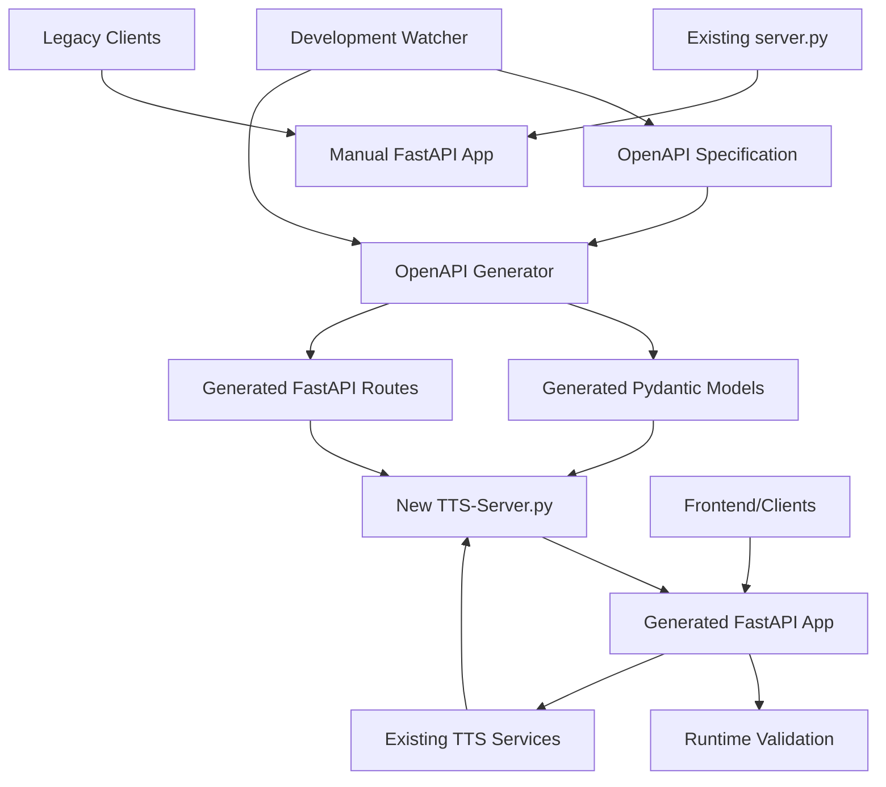
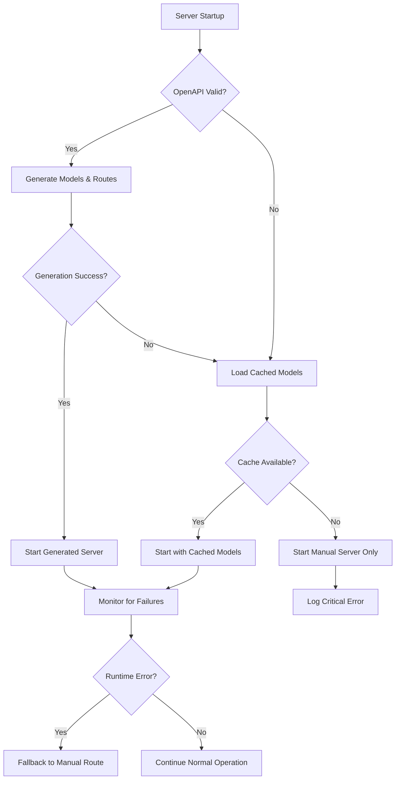

# implement-new-server-using-openapi-yaml-generated-api-and-models - Task 28

Execute task 28 for the implement-new-server-using-openapi-yaml-generated-api-and-models specification.

## Task Description
Update README.md with new server information

## Code Reuse
**Leverage existing code**: Existing README structure and examples

## Requirements Reference
**Requirements**: 1.4

## Usage
```
/Task:28-implement-new-server-using-openapi-yaml-generated-api-and-models
```

## Instructions

Execute with @spec-task-executor agent the following task: "Update README.md with new server information"

```
Use the @spec-task-executor agent to implement task 28: "Update README.md with new server information" for the implement-new-server-using-openapi-yaml-generated-api-and-models specification and include all the below context.

# Steering Context
## Steering Documents Context (Pre-loaded)

### Product Context
# Product Vision - Coqui TTS

## Product Overview
Coqui TTS is an advanced Text-to-Speech library that democratizes high-quality speech synthesis through open-source technology. As a maintained fork of the original Coqui AI project, it provides researchers, developers, and enthusiasts with cutting-edge TTS capabilities.

## Core Mission
Enable anyone to create natural, expressive speech synthesis with minimal technical barriers while advancing the state of the art in TTS research.

## Target Users

### Primary Users
- **AI Researchers**: Need flexible TTS models for speech research and experimentation
- **Application Developers**: Integrate TTS into applications, games, assistive technology
- **Content Creators**: Generate voiceovers, audiobooks, and multimedia content
- **Accessibility Teams**: Build tools for visually impaired and reading-disabled users

### Secondary Users
- **Educators**: Create educational content and language learning materials
- **Hobbyists**: Experiment with voice cloning and synthesis
- **Enterprise Teams**: Custom voice solutions for products and services

## Key Features

### Core Capabilities
- **1100+ Pre-trained Models**: Multi-language, multi-speaker models ready to use
- **Voice Cloning**: Create custom voices from 5-30 seconds of audio
- **Real-time Synthesis**: Streaming TTS with <200ms latency (XTTS)
- **Multi-language Support**: 17+ languages with automatic detection
- **Model Training**: Tools to train custom models on any dataset

### Advanced Features
- **Voice Conversion**: Convert speech between different speakers
- **Neural Vocoders**: High-quality audio generation (HiFiGAN, WaveGrad)
- **Streaming Support**: Real-time audio generation for interactive applications
- **Model Comparison**: Side-by-side evaluation of different TTS approaches

## Business Objectives

### Open Source Goals
1. **Community Growth**: Expand the TTS research and development community
2. **Research Advancement**: Push the boundaries of speech synthesis quality
3. **Accessibility**: Make TTS technology accessible globally
4. **Innovation**: Enable new applications through easy-to-use APIs

### Technical Objectives
1. **Performance**: Maintain state-of-the-art synthesis quality
2. **Usability**: Provide intuitive APIs for both research and production
3. **Scalability**: Support from single-user to enterprise deployments
4. **Reliability**: Ensure consistent, reproducible results

## Success Metrics

### Community Metrics
- GitHub stars, forks, and contributions
- PyPI download statistics
- Community discussions and support requests
- Research papers citing the project

### Technical Metrics
- Model quality scores (MOS, similarity metrics)
- Synthesis speed and latency measurements
- Memory usage and computational efficiency
- Cross-platform compatibility

### User Experience Metrics
- Time to first successful synthesis
- Documentation clarity and completeness
- Error rates and debugging ease
- Feature adoption rates

## Product Roadmap Priorities

### Short-term (Next 3 months)
- Enhanced web interface with advanced controls
- Improved model management and caching
- Better mobile and responsive design
- Performance optimizations

### Medium-term (3-12 months)
- New model architectures and improvements
- Expanded language support
- Advanced voice cloning features
- Integration with popular development frameworks

### Long-term (1+ years)
- Real-time conversation synthesis
- Emotional and style control
- Multi-modal synthesis (speech + visual)
- Edge deployment optimizations

---

### Technology Context
# Technology Stack - Coqui TTS

## Architecture Overview
Coqui TTS follows a modular architecture separating TTS models, vocoders, voice conversion, and serving infrastructure. The system supports both research experimentation and production deployment.

## Core Technologies

### Machine Learning Stack
- **PyTorch 2.1+**: Primary deep learning framework
- **TorchAudio**: Audio processing and feature extraction
- **NumPy 1.26+**: Numerical computations and array operations
- **SciPy**: Scientific computing and signal processing
- **Transformers 4.52.1+**: Pre-trained transformer models (Bark, XTTS)

### Audio Processing
- **LibROSA 0.11+**: Audio analysis and feature extraction
- **SoundFile**: Audio I/O operations
- **Cython 3.0+**: Performance-critical audio processing
- **Encodec**: Neural audio codec for compression

### Backend Services
- **FastAPI**: Modern async web framework for REST APIs
- **Uvicorn**: ASGI server with WebSocket support
- **Pydantic**: Data validation and API documentation
- **Python Multipart**: File upload handling

### Frontend Technologies
- **React 18**: UI framework with concurrent features
- **TypeScript 5.9+**: Type-safe JavaScript development
- **Vite 7.1+**: Build tool and development server
- **Jest 29**: Testing framework with JSDOM

### Development Tools
- **Ruff 0.9.1**: Fast Python linter and formatter
- **Pre-commit**: Git hooks for code quality
- **GitHub Actions**: CI/CD pipeline automation
- **Docker**: Containerization for development and deployment

## Model Architectures

### Text-to-Speech Models
- **XTTS v2**: GPT-based with streaming support, 17 languages
- **VITS**: Variational inference with normalizing flows
- **Bark**: Transformer-based generative model with non-speech sounds
- **Tortoise**: Autoregressive model for high-quality synthesis
- **Tacotron/Tacotron2**: Sequence-to-sequence with attention
- **GlowTTS**: Flow-based parallel synthesis
- **FastSpeech/FastSpeech2**: Non-autoregressive parallel synthesis

### Vocoders
- **HiFiGAN**: High-fidelity generative adversarial vocoder
- **WaveGrad**: Diffusion-based vocoder
- **MelGAN/MultibandMelGAN**: Lightweight GAN vocoders
- **WaveRNN**: Recurrent neural vocoder
- **UnivNet**: Universal vocoder

### Voice Conversion
- **FreeVC**: Any-to-any voice conversion
- **OpenVoice v1/v2**: Cross-lingual voice cloning
- **kNN-VC**: k-nearest neighbors voice conversion

## Technical Constraints

### Performance Requirements
- **Synthesis Speed**: Real-time factor < 1.0 for interactive use
- **Memory Usage**: Support systems with 4GB+ RAM
- **Latency**: <200ms for streaming synthesis (XTTS)
- **Quality**: MOS scores > 4.0 for natural speech

### Compatibility Requirements
- **Python**: 3.10, 3.11, 3.12 support
- **Platforms**: Linux (primary), macOS, Windows
- **Hardware**: CPU-only and GPU acceleration (CUDA, MPS)
- **Browsers**: Modern browsers for web interface

### Scalability Constraints
- **Model Size**: Balance quality vs. deployment size
- **Concurrent Users**: Support multiple simultaneous synthesis requests
- **Resource Management**: Efficient model loading and memory management

## Third-party Integrations

### Language Processing
- **Gruut**: Grapheme-to-phoneme conversion (German, Spanish, French)
- **espeak-ng**: Phonemization for multiple languages
- **Fairseq MMS**: 1100+ language models from Meta
- **Language-specific G2P**: Specialized processors for Bengali, Japanese, Korean, Chinese

### Model Distribution
- **Hugging Face Hub**: Model hosting and distribution
- **PyPI**: Package distribution
- **GitHub Releases**: Binary distributions and assets

### Audio Libraries
- **Monotonic Alignment Search**: Attention alignment optimization
- **Coqui TTS Trainer**: Training utilities and abstractions
- **Coqpit Config**: Configuration management

## Technical Decisions

### Framework Choices
- **PyTorch over TensorFlow**: Better research flexibility and dynamic graphs
- **FastAPI over Flask**: Modern async support and automatic documentation
- **React over Vue/Angular**: Large ecosystem and concurrent features
- **TypeScript over JavaScript**: Type safety for complex UI interactions

### Architecture Patterns
- **Modular Design**: Separate concerns for models, vocoders, and serving
- **Plugin Architecture**: Easy addition of new models and languages
- **Async Processing**: Non-blocking synthesis for web interface
- **Caching Strategy**: Intelligent model and result caching

### Quality Assurance
- **Type Checking**: MyPy for Python, TypeScript for frontend
- **Testing Strategy**: Unit, integration, and model validation tests
- **Code Quality**: Ruff linting with strict rules
- **Documentation**: Automated API docs with examples

## Performance Optimizations

### Model Optimization
- **ONNX Export**: Optimized inference for production
- **Quantization**: Reduced precision for faster inference
- **Model Pruning**: Remove unnecessary parameters
- **Batch Processing**: Efficient multi-request handling

### System Optimization
- **Memory Pooling**: Reuse audio buffers and tensors
- **Model Sharing**: Single model instance for multiple requests
- **Background Loading**: Preload commonly used models
- **Resource Monitoring**: Track GPU/CPU usage and memory

## Security Considerations

### Data Protection
- **No Persistent Storage**: Audio uploads not stored permanently
- **Input Validation**: Strict validation of audio and text inputs
- **Rate Limiting**: Prevent abuse of synthesis endpoints
- **CORS Configuration**: Secure cross-origin requests

### Deployment Security
- **Container Security**: Minimal base images and security scanning
- **Environment Isolation**: Separate development and production configs
- **Dependency Management**: Regular security updates
- **Access Control**: Authentication for administrative functions

---

### Structure Context
# Project Structure - Coqui TTS

## Directory Organization

### Root Level Structure
```
coqui-ai-TTS/
├── TTS/                    # Main package directory
├── docs/                   # Sphinx documentation
├── tests/                  # Test suites
├── recipes/                # Training recipes for different datasets
├── notebooks/              # Jupyter notebooks for tutorials
├── dockerfiles/            # Docker configurations
├── scripts/                # Utility scripts
├── pyproject.toml          # Python package configuration
├── README.md               # Project documentation
└── .claude/steering/       # Claude Code steering documents
```

### Core Package Structure (TTS/)
```
TTS/
├── api.py                  # Main API interface
├── tts/                    # Text-to-speech models
├── vocoder/                # Vocoder models
├── vc/                     # Voice conversion models
├── encoder/                # Speaker encoder models
├── server/                 # Web server and frontend
├── utils/                  # Shared utilities
├── config/                 # Configuration classes
└── bin/                    # Command-line tools
```

### Frontend Structure (TTS/server/frontend/)
```
frontend/
├── src/
│   ├── components/         # React components
│   ├── contexts/           # React contexts (Theme, Model, Audio)
│   ├── services/           # API clients and business logic
│   ├── types/              # TypeScript type definitions
│   ├── hooks/              # Custom React hooks
│   ├── test/               # Test utilities and setup
│   └── __tests__/          # Component tests
├── public/                 # Static assets
├── package.json            # Node.js dependencies
├── tsconfig.json           # TypeScript configuration
├── vite.config.ts          # Vite build configuration
└── jest.config.js          # Jest test configuration
```

## Naming Conventions

### Python Files and Modules
- **Snake case**: `model_manager.py`, `audio_processor.py`
- **Classes**: PascalCase (`AudioProcessor`, `ModelManager`)
- **Functions/Variables**: snake_case (`load_model`, `sample_rate`)
- **Constants**: UPPER_SNAKE_CASE (`DEFAULT_SAMPLE_RATE`, `MODEL_CACHE_SIZE`)

### Frontend Files
- **Components**: PascalCase (`ModelBrowser.tsx`, `AudioPlayer.tsx`)
- **Services**: camelCase (`apiClient.ts`, `modelService.ts`)
- **Types**: PascalCase (`TTSResponse`, `ModelInfo`)
- **Hooks**: camelCase with `use` prefix (`useModelState`, `useAudioPlayer`)

### Model and Configuration Names
- **Model names**: lowercase with hyphens (`xtts-v2`, `glow-tts`)
- **Config files**: snake_case (`xtts_config.py`, `hifigan_config.py`)
- **Dataset references**: lowercase (`ljspeech`, `vctk`, `common-voice`)

## File Organization Patterns

### Model Implementation Pattern
```
models/
├── base_tts.py             # Abstract base class
├── specific_model.py       # Model implementation
└── __init__.py             # Public API exports
```

### Configuration Pattern
```
configs/
├── shared_configs.py       # Common configuration base classes
├── model_config.py         # Model-specific configurations
└── __init__.py             # Configuration registry
```

### Layer Organization
```
layers/
├── model_name/             # Model-specific layers
│   ├── __init__.py
│   ├── encoder.py
│   ├── decoder.py
│   └── attention.py
└── generic/                # Shared layer implementations
    ├── transformer.py
    ├── convolution.py
    └── normalization.py
```

## Coding Standards

### Python Code Style
- **Line length**: 120 characters maximum
- **Imports**: Organized by standard, third-party, local
- **Docstrings**: Google style with type hints
- **Type hints**: Required for all public functions
- **Error handling**: Specific exception types, not bare except

### TypeScript/React Standards
- **Component structure**: Functional components with hooks
- **Props typing**: Explicit interfaces for all component props
- **Export pattern**: Named exports preferred over default
- **File organization**: One main component per file
- **Styling**: CSS modules or styled-components

### Documentation Standards
- **API documentation**: Automatically generated from docstrings
- **Code comments**: Explain why, not what
- **README files**: Present in each major directory
- **Type documentation**: Comprehensive interface definitions

## Testing Organization

### Test Directory Structure
```
tests/
├── aux_tests/              # Utility and helper tests
├── data_tests/             # Dataset and data loading tests
├── tts_tests/              # TTS model tests
├── vocoder_tests/          # Vocoder model tests
├── vc_tests/               # Voice conversion tests
├── text_tests/             # Text processing tests
├── inference_tests/        # End-to-end inference tests
├── integration/            # Integration tests
└── zoo_tests/              # Model zoo validation tests
```

### Frontend Test Structure
```
src/
├── __tests__/              # Component tests
│   └── ComponentName.test.tsx
├── test/                   # Test utilities
│   ├── setupTests.ts       # Jest configuration
│   └── testUtils.ts        # Testing helpers
└── components/
    └── ComponentName.tsx   # Component with co-located tests
```

### Test File Naming
- **Python**: `test_feature_name.py`
- **TypeScript**: `FeatureName.test.tsx` or `featureName.test.ts`
- **Integration**: `test_integration_scenario.py`

## Configuration Management

### Environment-specific Configs
- **Development**: Verbose logging, debug features enabled
- **Testing**: Minimal models, fast execution
- **Production**: Optimized models, performance monitoring

### Configuration File Hierarchy
1. **Default configs**: Built-in reasonable defaults
2. **Model configs**: Model-specific parameters
3. **User configs**: Local overrides and customizations
4. **Environment configs**: Deployment-specific settings

## Build and Deployment Patterns

### Python Package Structure
- **pyproject.toml**: Modern Python packaging with hatchling
- **Optional dependencies**: Grouped by functionality (server, languages)
- **Entry points**: CLI commands and module access
- **Include/exclude**: Careful package content management

### Frontend Build Process
- **Development**: Vite dev server with HMR
- **Testing**: Jest with jsdom environment
- **Production**: Optimized bundle with tree shaking
- **Static generation**: Pre-built assets for server integration

### Docker Organization
- **Multi-stage builds**: Separate build and runtime stages
- **Base images**: Minimal, security-focused base images
- **Layer optimization**: Careful layer ordering for caching
- **Environment handling**: Configurable via environment variables

## Version Control Patterns

### Branch Strategy
- **main**: Stable, production-ready code
- **dev**: Development integration branch
- **feature/***: Feature development branches
- **hotfix/***: Critical bug fixes

### Commit Message Format
- **Conventional commits**: `type(scope): description`
- **Types**: feat, fix, docs, style, refactor, test, chore
- **Scope**: Component or area affected
- **Breaking changes**: Clearly marked in commit body

### File Ignore Patterns
- **Build artifacts**: `__pycache__`, `dist/`, `build/`
- **Environment files**: `.env`, `*.local`
- **IDE files**: `.vscode/`, `.idea/`
- **Model files**: Large model weights and checkpoints
- **Generated content**: Auto-generated documentation

**Note**: Steering documents have been pre-loaded. Do not use get-content to fetch them again.

# Specification Context
## Specification Context (Pre-loaded): implement-new-server-using-openapi-yaml-generated-api-and-models

### Requirements
# Requirements Document

## Introduction

This feature involves implementing a new server architecture that leverages the existing OpenAPI specification (`TTS/server/openapi.yaml`) to automatically generate API endpoints and data models. The goal is to create a more maintainable, type-safe server implementation that follows modern API-first development practices while maintaining compatibility with the existing TTS functionality.

## Alignment with Product Vision

This feature supports several key goals from the product vision:
- **Scalability**: Automated API generation enables easier maintenance and expansion of server capabilities
- **Developer Experience**: Type-safe generated models reduce integration errors for API consumers
- **Technical Excellence**: Following OpenAPI standards improves API discoverability and tooling support
- **Community Growth**: Better API documentation and tooling reduces barriers for developers integrating TTS capabilities

## Requirements

### Requirement 1: OpenAPI-First Server Architecture

**User Story:** As a developer integrating TTS functionality, I want the server API to be generated from the OpenAPI specification, so that I can rely on consistent, well-documented endpoints with type-safe models.

#### Acceptance Criteria

1. WHEN the server starts THEN all API endpoints SHALL be automatically generated from the OpenAPI YAML specification
2. IF the OpenAPI specification is updated THEN the server SHALL reflect those changes without manual endpoint modifications
3. WHEN a request is made to any endpoint THEN the request/response SHALL be validated against the OpenAPI schema definitions
4. WHEN API documentation is requested THEN it SHALL be automatically generated and served from the OpenAPI specification

### Requirement 2: Automated Model Generation

**User Story:** As a backend developer, I want Pydantic models to be automatically generated from OpenAPI schemas, so that I can ensure type safety and reduce manual model maintenance.

#### Acceptance Criteria

1. WHEN a client sends a request THEN the server SHALL validate input using generated Pydantic models and return validation errors for invalid data
2. IF an OpenAPI schema changes THEN the server SHALL detect the change and regenerate models on next startup
3. WHEN processing TTS requests THEN validation SHALL enforce data types and constraints defined in the OpenAPI specification
4. WHEN the server responds THEN the response format SHALL match the generated model structure exactly

### Requirement 3: Backward Compatibility

**User Story:** As an existing API consumer, I want the new OpenAPI-generated server to maintain compatibility with current endpoints, so that my existing integrations continue to work without changes.

#### Acceptance Criteria

1. WHEN the new server is deployed THEN all existing API endpoints SHALL remain functional with identical behavior
2. IF a legacy endpoint receives a request THEN the response format SHALL be identical to the current implementation
3. WHEN clients use existing authentication methods THEN they SHALL continue to work without modification
4. WHEN error responses are returned THEN they SHALL match the current error format and HTTP status codes

### Requirement 4: Development Workflow Integration

**User Story:** As a DevOps engineer, I want the OpenAPI-generated server to integrate with existing development tools, so that I can maintain efficient development workflows.

#### Acceptance Criteria

1. WHEN the development server starts with an invalid OpenAPI specification THEN it SHALL display clear error messages and refuse to start
2. IF OpenAPI specification validation fails THEN the server SHALL log specific line numbers and validation errors
3. WHEN running existing test suites THEN the generated models SHALL be compatible with current test infrastructure
4. WHEN debugging server issues THEN generated code SHALL provide meaningful stack traces that reference original OpenAPI definitions

### Requirement 5: Performance Parity

**User Story:** As a production user, I want the OpenAPI-generated server to perform at least as well as the current implementation, so that my TTS synthesis workflows are not impacted.

#### Acceptance Criteria

1. WHEN handling TTS synthesis requests THEN response times SHALL not exceed current implementation by more than 5%
2. IF concurrent requests are processed THEN throughput SHALL be at least equal to current implementation
3. WHEN memory usage is measured THEN it SHALL not exceed current implementation by more than 10%
4. WHEN the server is under load THEN error rates SHALL not increase compared to current implementation

### Requirement 6: Migration and Deployment Strategy

**User Story:** As a DevOps engineer, I want a safe migration path from the current server to the OpenAPI-generated server, so that I can deploy updates without service disruption.

#### Acceptance Criteria

1. WHEN the OpenAPI generation fails THEN the server SHALL fallback to the current manual server implementation
2. IF the generated server encounters critical errors THEN it SHALL provide a rollback mechanism to the previous version
3. WHEN deploying in production THEN both old and new server SHALL be testable side-by-side during transition
4. WHEN migration is complete THEN existing configuration files SHALL work without modification

### Requirement 7: Integration with Model Management

**User Story:** As a backend developer, I want the OpenAPI-generated server to work seamlessly with existing model loading and caching systems, so that TTS functionality remains unaffected.

#### Acceptance Criteria

1. WHEN loading TTS models THEN the generated server SHALL use existing ModelManager and ModelCacheManager classes
2. IF model loading fails THEN error responses SHALL match current error format and include appropriate HTTP status codes
3. WHEN processing model operations THEN existing model state management and threading SHALL continue to work
4. WHEN caching models THEN existing cache policies and memory management SHALL be preserved

## Non-Functional Requirements

### Performance
- Server startup time with OpenAPI generation SHALL not exceed 30 seconds on systems with 4GB+ RAM
- API endpoint response times SHALL remain under 200ms for non-synthesis operations (aligned with <200ms latency requirement)
- Memory overhead for generated models SHALL not exceed 50MB additional usage
- Model generation time SHALL complete within 5 seconds of specification changes
- Real-time synthesis SHALL maintain <200ms latency requirement for XTTS streaming

### Security
- Generated endpoints SHALL inherit existing CORS configuration and authentication mechanisms
- Request validation SHALL prevent injection attacks through Pydantic schema enforcement
- Error messages SHALL not expose internal file paths, model weights locations, or server implementation details
- Generated models SHALL sanitize input data according to OpenAPI field constraints and validation rules
- File upload endpoints SHALL maintain existing security restrictions for audio files

### Reliability
- Server SHALL validate OpenAPI specification at startup using official OpenAPI 3.0 validators
- Generated code SHALL include comprehensive error handling with meaningful error codes matching existing patterns
- Server SHALL fallback to manual server implementation if OpenAPI generation fails during startup
- Database connections and model loading SHALL use existing connection pooling and retry mechanisms
- Docker containerization SHALL remain compatible with existing deployment configurations

### Usability
- OpenAPI specification changes SHALL be reflected in development environment within 1 second (hot-reload support)
- Generated API documentation SHALL be accessible at `/docs` endpoint using existing FastAPI automatic documentation
- Error messages for OpenAPI validation failures SHALL include line numbers and specific validation errors
- Integration with existing logging (using existing ConsoleFormatter) and monitoring SHALL be maintained
- Frontend compatibility SHALL be verified to ensure existing React TypeScript components continue functioning

---

### Design
# Design Document

## Overview

This design implements a new OpenAPI-first server architecture that automatically generates API endpoints and Pydantic models from the existing OpenAPI specification (`TTS/server/openapi.yaml`). The solution builds upon the existing FastAPI server foundation while introducing runtime code generation to ensure the API implementation stays perfectly synchronized with the OpenAPI specification.

The architecture leverages the OpenAPI Generator ecosystem via `openapi-generator-pip` for robust Pydantic model generation and FastAPI's dynamic routing capabilities for endpoint generation, ensuring minimal performance overhead while maximizing maintainability.

## Steering Document Alignment

### Technical Standards (tech.md)
The design follows documented technical patterns:
- **FastAPI framework**: Continues using the established FastAPI 3.x stack with async/await patterns
- **Pydantic models**: Extends existing Pydantic BaseModel usage with generated models
- **Python typing**: Maintains strict type hints throughout generated and manual code
- **PyTorch integration**: Preserves existing model loading patterns without disruption
- **Error handling**: Uses existing HTTPException patterns and error response formats

### Project Structure (structure.md)
The implementation respects project organization conventions:
- **TTS/server/**: All generated code remains in server directory following snake_case conventions
- **Modular design**: Separates concerns between generation, validation, and runtime components
- **Configuration management**: Integrates with existing configuration patterns
- **Testing structure**: Maintains existing test organization and naming conventions

## Code Reuse Analysis

### Existing Components to Leverage
- **Model State Management (`model_state.py`)**: New tts-server.py will use existing `GlobalModelState` and `ModelCacheManager` classes
- **Existing Generated Client (`TTS/server/gen/`)**: Already contains generated Pydantic models from OpenAPI Generator that we can build upon 
- **Error Handling (`error_handlers.py`)**: New server will import and use existing error response patterns
- **CORS and Middleware Patterns**: New server will replicate existing CORS configuration and middleware setup
- **Business Logic (`TTS.api`, `ModelManager`)**: All existing TTS functionality will be imported and integrated

### Integration Points
- **OpenAPI Specification (`openapi.yaml`)**: Primary source of truth for all generated code
- **Existing Generated Models (`gen/openapi_client/models/`)**: Can be imported and used directly or as templates for server-side generation
- **Model Loading Pipeline**: Generated endpoints will integrate with existing `TTS.api` and `ModelManager` classes
- **Frontend API Client**: Generated server will maintain compatibility with existing React TypeScript components
- **Authentication/Authorization**: Generated endpoints will respect existing CORS and security configurations

## Architecture

The architecture follows a layered approach with clear separation between generation-time and runtime components:



## Components and Interfaces

### Component 1: OpenAPI Code Generator
- **Purpose**: Parses OpenAPI spec and generates Python code for models and routes using OpenAPI Generator
- **Interfaces**: 
  - `generate_models()`: Creates Pydantic models from OpenAPI schemas using `openapi-generator-cli`
  - `generate_routes()`: Creates FastAPI route handlers from OpenAPI paths
  - `validate_spec()`: Validates OpenAPI specification compliance
- **Dependencies**: `openapi.yaml`, `openapi-generator-pip` package
- **Reuses**: Existing FastAPI patterns, leverages existing `TTS/server/gen/` structure

### Component 2: Generated Model Registry
- **Purpose**: Manages dynamically generated Pydantic models and provides runtime access
- **Interfaces**:
  - `get_model(schema_name: str) -> Type[BaseModel]`: Retrieves generated model class
  - `register_model(name: str, model: Type[BaseModel])`: Registers new generated model
  - `refresh_models()`: Regenerates models when OpenAPI spec changes
- **Dependencies**: Generated model classes, runtime model cache
- **Reuses**: Existing model patterns from `server.py:51-85`

### Component 3: TTS Server Builder
- **Purpose**: Creates the new tts-server.py that integrates generated routes with existing TTS business logic
- **Interfaces**:
  - `create_tts_server()`: Creates new FastAPI app instance with generated routes
  - `integrate_business_logic(app: FastAPI)`: Connects generated routes to existing TTS services
  - `apply_middleware(app: FastAPI)`: Applies CORS, logging, and other middleware
- **Dependencies**: Generated models, generated routes, existing TTS services
- **Reuses**: Business logic from existing server.py route handlers

### Component 4: Spec Validation and Hot Reload
- **Purpose**: Validates OpenAPI specification and triggers regeneration on changes
- **Interfaces**:
  - `validate_openapi_spec(spec_path: str) -> ValidationResult`: Validates spec syntax and semantics
  - `watch_spec_changes(spec_path: str, callback: Callable)`: Monitors file for changes
  - `trigger_regeneration()`: Initiates model and route regeneration
- **Dependencies**: OpenAPI spec file, file system watcher
- **Reuses**: Existing startup event patterns from `server.py:280`

### Component 5: Deployment Strategy Controller
- **Purpose**: Manages transition between existing server.py and new tts-server.py
- **Interfaces**:
  - `start_parallel_servers()`: Runs both servers simultaneously for testing
  - `route_traffic(request: Request) -> str`: Determines which server handles request
  - `health_check_both_servers()`: Monitors health of both server instances
  - `switch_primary_server(target: str)`: Changes primary server for new requests
- **Dependencies**: Both server instances, load balancer/proxy configuration
- **Reuses**: Health check patterns and monitoring from existing server

## Data Models

The generated models will follow this hierarchy:

### Base Generated Model
```python
class GeneratedBaseModel(BaseModel):
    """Base class for all OpenAPI-generated models"""
    model_config = ConfigDict(
        populate_by_name=True,
        validate_assignment=True,
        str_strip_whitespace=True,
        use_enum_values=True
    )
    
    @classmethod
    def from_openapi_schema(cls, schema: dict) -> Type['GeneratedBaseModel']:
        """Factory method to create models from OpenAPI schema"""
        pass
```

### Request Models (Generated from OpenAPI components/schemas)
```python
class GeneratedTTSRequest(GeneratedBaseModel):
    """Auto-generated from TTSRequest schema in openapi.yaml"""
    text: str = Field(..., min_length=1, max_length=1000)
    speaker: Optional[str] = None
    language: Optional[str] = None
    format: str = Field(default="wav", regex="^(wav|mp3|opus|aac|flac|pcm)$")
    
    # Generated validation methods
    @field_validator('text')
    def validate_text(cls, v):
        # Auto-generated validation from OpenAPI constraints
        pass
```

### Response Models (Generated from OpenAPI responses)
```python
class GeneratedHealthResponse(GeneratedBaseModel):
    """Auto-generated from HealthResponse schema in openapi.yaml"""
    status: str
    model_loaded: bool
    components: Dict[str, Any]
    cache: Optional[Dict[str, Any]] = None
    model_name: Optional[str] = None
    model_capabilities: Optional[Dict[str, Any]] = None
```

## Error Handling

### Error Scenarios
1. **OpenAPI Specification Parsing Failure**
   - **Handling**: Log detailed error with line numbers, start server in fallback mode using manual routes
   - **User Impact**: Server continues functioning with existing endpoints, admin sees clear error messages

2. **Model Generation Failure**
   - **Handling**: Use cached previously generated models, log generation errors with context
   - **User Impact**: Server uses last known good models, degraded functionality only for new/changed schemas

3. **Route Registration Conflicts**
   - **Handling**: Prioritize manually defined routes over generated ones, log conflicts for resolution
   - **User Impact**: Manual routes take precedence, ensuring critical functionality remains available

4. **Runtime Validation Errors**
   - **Handling**: Return HTTP 422 with detailed field-level errors matching existing FastAPI patterns
   - **User Impact**: Clear validation feedback helps clients correct requests

## Testing Strategy

### Unit Testing
- **Generated Model Tests**: Verify models correctly validate according to OpenAPI constraints
  - Test field validation matches OpenAPI schema constraints
  - Verify error messages match FastAPI validation patterns
  - Test model serialization/deserialization consistency
- **Route Generation Tests**: Ensure routes are created with correct methods, paths, and validation
  - Test route path matching against OpenAPI specification
  - Verify HTTP method handling (GET, POST, etc.)
  - Test request/response model binding
- **Specification Parsing Tests**: Validate OpenAPI spec parsing handles edge cases correctly
  - Test invalid YAML syntax handling
  - Test missing required schema properties
  - Test circular reference detection
- **Code Generation Performance**: Benchmark generation time against requirements
  - Target: Model generation completes within 5 seconds
  - Target: Memory overhead < 50MB during generation
  - Test generation with large OpenAPI specifications

### Integration Testing  
- **API Compatibility Tests**: Verify generated endpoints produce identical responses to manual ones
  - Compare response formats byte-for-byte with existing endpoints
  - Test all HTTP status codes match (200, 422, 500, etc.)
  - Verify error response structure consistency
- **TTS Model Integration**: Test generated endpoints with existing TTS pipeline
  - Test model loading through generated endpoints using existing ModelManager
  - Verify audio synthesis works through generated /api/v1/tts endpoint
  - Test model caching integration with existing ModelCacheManager
- **Frontend Compatibility**: Ensure existing React TypeScript components continue working
  - Test existing API client calls against generated endpoints
  - Verify TypeScript type compatibility with generated schemas
  - Test error handling in frontend components
- **Performance Regression**: Measure performance against current implementation
  - Target: Response times within 5% of current implementation
  - Target: Memory usage within 10% of current implementation
  - Target: Concurrent request throughput maintains parity

### End-to-End Testing
- **Server Lifecycle**: Test complete server startup and shutdown processes
  - Test OpenAPI generation during startup (target: <30 seconds)
  - Test graceful shutdown with active requests
  - Test server restart with cached generated models
- **Hot-Reload Scenarios**: Test development workflow with spec changes
  - Test 1-second hot-reload requirement with file watching
  - Test partial generation failures with fallback to cached models  
  - Test validation error display with line numbers
- **Migration Testing**: Test transition strategies from manual to generated endpoints
  - Test side-by-side deployment with traffic splitting
  - Test rollback scenarios when generated endpoints fail
  - Test configuration compatibility across versions

## Performance Analysis and Optimization

### Code Generation Performance
- **Generation Time**: Target <5 seconds for complete model regeneration
  - Use caching for unchanged OpenAPI schema components
  - Implement incremental generation for modified schemas only
  - Optimize YAML parsing with streaming parser for large specs
- **Memory Overhead**: Target <50MB additional memory usage
  - Cache generated classes efficiently using weak references
  - Implement model class garbage collection for unused schemas
  - Use memory-mapped files for large generated code modules

### Runtime Performance Optimizations
- **Route Resolution**: Minimize lookup overhead for generated routes
  - Pre-compile route patterns at generation time
  - Use FastAPI's internal routing optimizations
  - Cache model validation functions for reuse
- **Model Validation**: Ensure generated validation is as fast as manual validation
  - Generate optimized validator functions using Pydantic V2 patterns  
  - Avoid dynamic attribute access in validation code
  - Use compiled regex patterns for field validation

### Hot-Reload Implementation Strategy
To achieve the 1-second hot-reload requirement:
1. **File Watching**: Use `watchdog` library with efficient event filtering
2. **Incremental Generation**: Only regenerate changed schema components
3. **Background Processing**: Generate new models in background thread
4. **Atomic Replacement**: Swap model registry atomically to avoid request failures

## Deployment and Migration Strategy

### Fallback Mechanisms


### Parallel Deployment Strategy
1. **Phase 1**: Deploy tts-server.py alongside existing server.py on different ports
2. **Phase 2**: Test tts-server.py independently with automated test suite
3. **Phase 3**: Route subset of production traffic to tts-server.py for validation
4. **Phase 4**: Gradually increase traffic ratio (10% → 50% → 90% → 100%)
5. **Phase 5**: Complete migration with server.py as backup, then deprecate

### Migration Safety Measures
- **Circuit Breaker Pattern**: Automatically disable generated endpoints on repeated failures
- **Health Monitoring**: Continuous monitoring of generated endpoint performance
- **Rollback Triggers**: Automatic rollback if error rates exceed 1% or response times increase >10%

## Implementation Approach

### Phase 1: Foundation and Safety (Requirements 1, 2, 6)
1. **OpenAPI Generator Integration**
   - Install and configure `openapi-generator-pip` for Python server generation
   - Leverage existing `TTS/server/gen/` structure as foundation for server-side models
   - Configure OpenAPI Generator templates for FastAPI server generation (instead of client generation)
2. **Code Generation Core**
   - Build server model generator using `openapi-generator generate -g python-fastapi`
   - Implement route generator that uses OpenAPI Generator's FastAPI server templates
   - Add generated code caching and versioning system compatible with OpenAPI Generator output
3. **Fallback and Safety Systems**
   - Create manual server fallback when OpenAPI Generator fails
   - Implement model registry with atomic updates for generated classes
   - Add comprehensive error handling and logging for generation pipeline

### Phase 2: TTS Integration (Requirements 3, 7)  
1. **Business Logic Integration**
   - Connect generated routes to existing TTS.api and ModelManager
   - Implement compatibility adapters for existing business logic
   - Ensure generated endpoints use existing model state management
2. **API Compatibility Layer**
   - Create compatibility bridge for gradual endpoint migration
   - Implement request/response format matching with existing endpoints
   - Add HTTP status code consistency validation
3. **Performance Optimization**
   - Optimize generated model validation for TTS use cases
   - Implement caching for frequently accessed models
   - Add performance monitoring and benchmarking

### Phase 3: Development Experience (Requirement 4)
1. **Hot-Reload System**
   - Implement file watching with 1-second target response time
   - Add incremental generation for changed schemas only
   - Create development server with automatic restart on failures
2. **Developer Tools**
   - Add comprehensive validation error reporting with line numbers
   - Create debugging utilities for generated code inspection  
   - Implement development dashboard for generation status
3. **Testing Integration**
   - Ensure generated code works with existing test infrastructure
   - Add testing utilities for generated model validation
   - Create test fixtures for generated endpoint testing

### Phase 4: Production Readiness (Requirement 5)
1. **Performance Monitoring**
   - Implement real-time performance comparison with manual endpoints
   - Add memory usage monitoring for generated code
   - Create alerting for performance degradation
2. **Production Deployment**
   - Implement blue-green deployment with traffic routing
   - Add automated rollback on performance or error rate thresholds
   - Create production monitoring dashboards
3. **Documentation and Training**
   - Generate documentation for all generated endpoints
   - Create migration guides for existing API consumers
   - Add troubleshooting guides for common issues

### Code Organization
```
TTS/server/
├── openapi.yaml                    # Source of truth
├── server.py                       # EXISTING: Manual server (preserved)
├── tts-server.py                   # NEW: OpenAPI-generated server entry point
├── gen/                            # Existing OpenAPI Generator output (client)
│   ├── openapi_client/             # Keep existing client generation
│   └── README.md                   
├── generated_server/               # NEW: Server-side generated code
│   ├── __init__.py
│   ├── models/                     # Generated Pydantic models (server-side)
│   │   ├── __init__.py
│   │   └── *.py                    # Individual model files from openapi-generator
│   ├── apis/                       # Generated FastAPI route stubs
│   │   ├── __init__.py
│   │   └── *.py                    # Route definitions from openapi-generator
│   └── main.py                     # Generated FastAPI app template
├── codegen/                        # Code generation utilities
│   ├── __init__.py
│   ├── generator.py                # Wrapper around openapi-generator-pip
│   ├── validator.py                # OpenAPI spec validation
│   └── watcher.py                  # Hot-reload file watching
├── deployment/                     # Deployment strategy utilities
│   ├── __init__.py
│   ├── parallel_runner.py          # Run both servers simultaneously
│   └── traffic_router.py           # Route traffic between servers
└── business_logic/                 # Shared business logic adapters
    ├── __init__.py
    ├── tts_handlers.py             # TTS business logic for generated routes
    └── model_handlers.py           # Model management logic for generated routes
```

This structure maintains complete separation between the existing manual server and the new OpenAPI-generated server while enabling safe parallel deployment and testing.

**Note**: Specification documents have been pre-loaded. Do not use get-content to fetch them again.

## Task Details
- Task ID: 28
- Description: Update README.md with new server information
- Leverage: Existing README structure and examples
- Requirements: 1.4

## Instructions
- Implement ONLY task 28: "Update README.md with new server information"
- Follow all project conventions and leverage existing code
- Mark the task as complete using: claude-code-spec-workflow get-tasks implement-new-server-using-openapi-yaml-generated-api-and-models 28 --mode complete
- Provide a completion summary
```

## Task Completion
When the task is complete, mark it as done:
```bash
claude-code-spec-workflow get-tasks implement-new-server-using-openapi-yaml-generated-api-and-models 28 --mode complete
```

## Next Steps
After task completion, you can:
- Execute the next task using /implement-new-server-using-openapi-yaml-generated-api-and-models-task-[next-id]
- Check overall progress with /spec-status implement-new-server-using-openapi-yaml-generated-api-and-models
