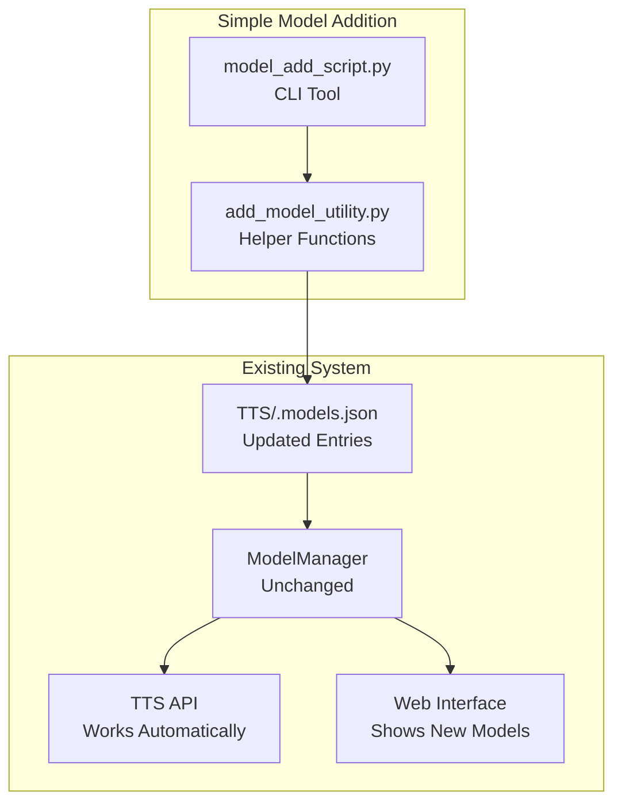

# Adding New Models - Design Specification

## Overview
This design implements a simple system for adding new TTS models to `.models.json` and integrating them into the existing Coqui TTS workflow. The focus is on minimal changes that extend current functionality without complex new architecture.

## Simplified Architecture



## Simple Component Design

### 1. CLI Tool for Adding Models

**Location**: `scripts/add_model.py`

**Purpose**: Simple command-line script to add models to `.models.json`

```python
#!/usr/bin/env python3
"""Simple CLI tool to add new models to .models.json"""

import argparse
import json
from pathlib import Path
from TTS.utils.manage import ModelManager
from TTS.utils.model_addition import add_model_to_registry

def main():
    parser = argparse.ArgumentParser(description="Add new model to TTS registry")
    parser.add_argument("--model-name", required=True, help="Name of the model")
    parser.add_argument("--model-type", required=True, choices=["tts_models", "vocoder_models", "voice_conversion_models"])
    parser.add_argument("--language", default="custom", help="Language code")
    parser.add_argument("--dataset", default="custom", help="Dataset name")
    parser.add_argument("--hf-url", nargs="+", help="Hugging Face URLs for model files")
    parser.add_argument("--model-url", nargs="+", help="Direct URLs for model files")
    parser.add_argument("--description", required=True, help="Model description")
    parser.add_argument("--license", required=True, help="Model license")
    parser.add_argument("--author", required=True, help="Model author")
    parser.add_argument("--contact", help="Contact information")
    
    args = parser.parse_args()
    
    model_entry = {
        "model_name": args.model_name,
        "description": args.description,
        "license": args.license,
        "author": args.author,
        "contact": args.contact or "",
        "model_hash": "user_added",
        "tos_required": False,
        "default_vocoder": None,
    }
    
    if args.hf_url:
        model_entry["hf_url"] = args.hf_url
    if args.model_url:
        model_entry["model_url"] = args.model_url
    
    success = add_model_to_registry(
        model_entry=model_entry,
        model_type=args.model_type,
        language=args.language,
        dataset=args.dataset
    )
    
    if success:
        print(f"✅ Successfully added {args.model_name} to registry")
    else:
        print(f"❌ Failed to add {args.model_name} to registry")

if __name__ == "__main__":
    main()
```

### 2. Simple Helper Functions

**Location**: `TTS/utils/model_addition.py`

**Purpose**: Simple utility functions to add models to `.models.json`

```python
"""Simple utilities for adding models to .models.json"""

import json
import logging
from pathlib import Path
from typing import Dict, Any, Optional
from TTS.config import read_json_with_comments

logger = logging.getLogger(__name__)

def add_model_to_registry(
    model_entry: Dict[str, Any],
    model_type: str = "tts_models", 
    language: str = "custom",
    dataset: str = "custom",
    models_file: Optional[Path] = None
) -> bool:
    """
    Add a model entry to .models.json
    
    Args:
        model_entry: Dictionary with model metadata
        model_type: Type of model (tts_models, vocoder_models, etc.)
        language: Language code for organization
        dataset: Dataset name for organization  
        models_file: Path to .models.json file
    
    Returns:
        bool: True if successful, False otherwise
    """
    if models_file is None:
        models_file = Path(__file__).parent / "../.models.json"
    
    try:
        # Load existing registry
        models_dict = read_json_with_comments(models_file)
        
        # Ensure structure exists
        if model_type not in models_dict:
            models_dict[model_type] = {}
        if language not in models_dict[model_type]:
            models_dict[model_type][language] = {}
        if dataset not in models_dict[model_type][language]:
            models_dict[model_type][language][dataset] = {}
        
        # Add the model
        model_name = model_entry["model_name"]
        models_dict[model_type][language][dataset][model_name] = model_entry
        
        # Write back to file
        with open(models_file, 'w', encoding='utf-8') as f:
            json.dump(models_dict, f, indent=2, ensure_ascii=False)
        
        logger.info(f"Added model {model_name} to registry")
        return True
        
    except Exception as e:
        logger.error(f"Failed to add model to registry: {e}")
        return False

def validate_model_entry(model_entry: Dict[str, Any]) -> bool:
    """Basic validation of model entry"""
    required_fields = ["model_name", "description", "license", "author"]
    return all(field in model_entry for field in required_fields)

def list_registry_models(models_file: Optional[Path] = None) -> Dict[str, Any]:
    """List all models in the registry"""
    if models_file is None:
        models_file = Path(__file__).parent / "../.models.json"
    
    return read_json_with_comments(models_file)
```

## Integration with Existing Workflow

Once models are added to `.models.json` using the CLI tool, they automatically work with the existing system:

### 1. Existing ModelManager Integration
- **No changes needed** - ModelManager already reads from `.models.json`
- New models appear in `TTS().list_models()` automatically
- Existing download and caching mechanisms work unchanged

### 2. Existing API Integration  
- **No changes needed** - TTS API automatically discovers new models
- Models can be loaded with `TTS(model_name="tts_models/custom/custom/my_model")`
- All existing functionality (synthesis, voice cloning) works automatically

### 3. Existing Web Interface Integration
- **No changes needed** - Frontend model browser automatically shows new models
- Model selection dropdowns include new models
- All existing UI features work with new models

## Simple Usage Examples

### Adding a Hugging Face Model

```bash
# Add a Hugging Face TTS model
python scripts/add_model.py \
  --model-name "my_awesome_model" \
  --model-type "tts_models" \
  --description "Awesome TTS model from HF" \
  --license "MIT" \
  --author "HF User" \
  --hf-url "https://huggingface.co/user/model/resolve/main/model.pth" \
              "https://huggingface.co/user/model/resolve/main/config.json"
```

### Adding a Custom Model

```bash  
# Add a locally trained model
python scripts/add_model.py \
  --model-name "my_custom_model" \
  --model-type "tts_models" \
  --description "My custom trained XTTS model" \
  --license "Apache-2.0" \
  --author "Me" \
  --model-url "https://my-server.com/models/model.pth" \
             "https://my-server.com/models/config.json"
```

### Using the New Model

```python
# The model is now available in the normal TTS workflow
from TTS.api import TTS

# List models (new model will appear)
tts = TTS()
print(tts.list_models())  # Will include "tts_models/custom/custom/my_awesome_model"

# Use the new model
tts = TTS("tts_models/custom/custom/my_awesome_model")
tts.tts_to_file("Hello world!", file_path="output.wav")
```

## Simple Workflow

1. **User runs CLI script** with model metadata
2. **Script adds entry to `.models.json`** using existing structure
3. **Existing system automatically picks up the new model** - no changes needed
4. **Model is available everywhere** - API, Web UI, CLI tools

## Registry Structure

New models are added to the existing `.models.json` structure:

```json
{
  "tts_models": {
    "custom": {
      "custom": {
        "my_awesome_model": {
          "model_name": "my_awesome_model",
          "description": "Awesome TTS model from HF", 
          "license": "MIT",
          "author": "HF User",
          "contact": "",
          "model_hash": "user_added",
          "tos_required": false,
          "default_vocoder": null,
          "hf_url": [
            "https://huggingface.co/user/model/resolve/main/model.pth",
            "https://huggingface.co/user/model/resolve/main/config.json"
          ]
        }
      }
    }
  }
}
```

## Implementation Benefits

- **Zero scope creep** - Only adds models to registry, no complex systems
- **Leverages existing architecture** - ModelManager, TTS API, Web UI all work unchanged  
- **Simple and maintainable** - Just a CLI script and helper function
- **Immediate integration** - New models work with all existing features automatically

## Steering Document Alignment

### Tech.md Alignment
The design strictly follows the established technology stack and patterns:
- **PyTorch Integration**: Maintains existing PyTorch model loading patterns and extends BaseTTS hierarchy
- **FastAPI Architecture**: Extends existing FastAPI server with new endpoints following established patterns
- **React Frontend**: Integrates with existing React 18 components using established hooks and context patterns
- **Async Processing**: Uses established async patterns for non-blocking synthesis operations
- **Caching Strategy**: Builds on existing model caching and sharing mechanisms

### Structure.md Alignment  
The design follows all established naming and organization conventions:
- **Python naming**: snake_case for modules (`model_addition_manager.py`), PascalCase for classes (`ModelAdditionManager`)
- **Directory organization**: New components placed in appropriate TTS/ subdirectories following existing patterns
- **Configuration management**: Extends existing Coqpit patterns for configuration handling
- **Testing organization**: Follows established test directory structure and naming conventions

## Code Reuse Analysis

### Existing Components to Leverage

**ModelManager Class**: 
- Extend existing `ModelManager` instead of replacing it
- Reuse `read_models_file()`, `_list_models()`, and download mechanisms
- Build on existing progress bar and tqdm integration

**ModelItem TypedDict**:
- Extend existing `ModelItem` schema instead of creating new `ModelRegistryEntry`
- Add optional fields to existing schema maintaining backward compatibility
- Preserve existing validation patterns for required fields

**License Validation**:
- Reuse existing `LICENSE_URLS` dictionary for license validation
- Integrate with existing license compliance checking
- Extend with additional license types as needed

**User Data Directory**:
- Leverage existing `get_user_data_dir("tts")` from trainer.io
- Follow established cache directory organization patterns
- Maintain compatibility with existing model storage structure

**Configuration System**:
- Extend existing Coqpit-based configuration classes
- Integrate with current `load_config()` and validation systems
- Follow established configuration hierarchy patterns

**API Patterns**:
- Follow existing FastAPI endpoint patterns from server.py
- Reuse established error handling and response models
- Integrate with existing authentication and CORS middleware

This design provides a comprehensive, extensible system for adding new models while maintaining full compatibility with existing Coqui TTS architecture and preserving `TTS/.models.json` as the single source of truth for model management.