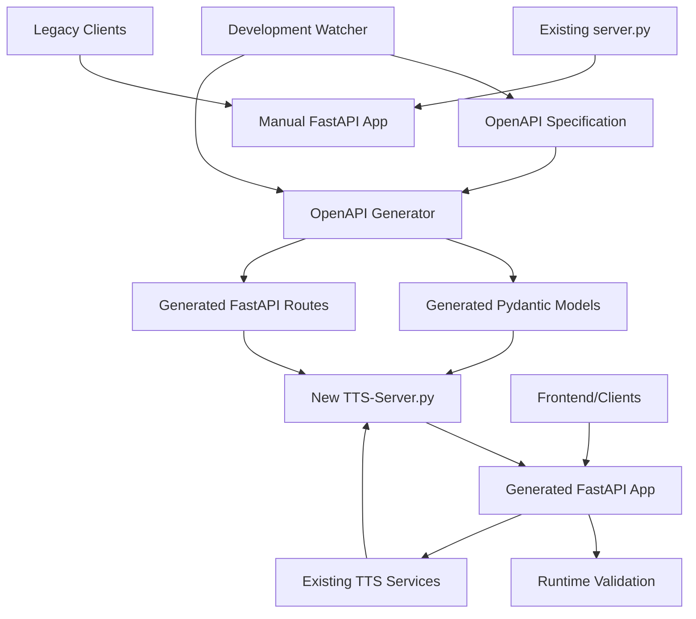
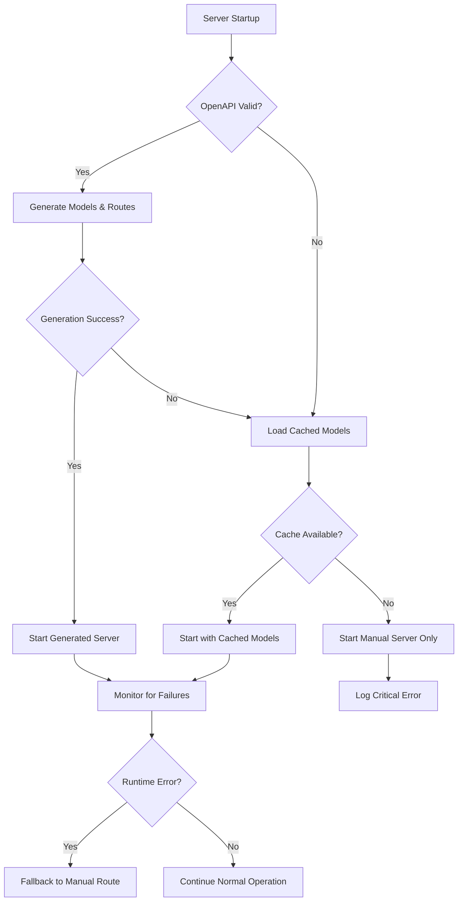

# Design Document

## Overview

This design implements a new OpenAPI-first server architecture that automatically generates API endpoints and Pydantic models from the existing OpenAPI specification (`TTS/server/openapi.yaml`). The solution builds upon the existing FastAPI server foundation while introducing runtime code generation to ensure the API implementation stays perfectly synchronized with the OpenAPI specification.

The architecture leverages the OpenAPI Generator ecosystem via `openapi-generator-pip` for robust Pydantic model generation and FastAPI's dynamic routing capabilities for endpoint generation, ensuring minimal performance overhead while maximizing maintainability.

## Steering Document Alignment

### Technical Standards (tech.md)
The design follows documented technical patterns:
- **FastAPI framework**: Continues using the established FastAPI 3.x stack with async/await patterns
- **Pydantic models**: Extends existing Pydantic BaseModel usage with generated models
- **Python typing**: Maintains strict type hints throughout generated and manual code
- **PyTorch integration**: Preserves existing model loading patterns without disruption
- **Error handling**: Uses existing HTTPException patterns and error response formats

### Project Structure (structure.md)
The implementation respects project organization conventions:
- **TTS/server/**: All generated code remains in server directory following snake_case conventions
- **Modular design**: Separates concerns between generation, validation, and runtime components
- **Configuration management**: Integrates with existing configuration patterns
- **Testing structure**: Maintains existing test organization and naming conventions

## Code Reuse Analysis

### Existing Components to Leverage
- **Model State Management (`model_state.py`)**: New tts-server.py will use existing `GlobalModelState` and `ModelCacheManager` classes
- **Existing Generated Client (`TTS/server/gen/`)**: Already contains generated Pydantic models from OpenAPI Generator that we can build upon 
- **Error Handling (`error_handlers.py`)**: New server will import and use existing error response patterns
- **CORS and Middleware Patterns**: New server will replicate existing CORS configuration and middleware setup
- **Business Logic (`TTS.api`, `ModelManager`)**: All existing TTS functionality will be imported and integrated

### Integration Points
- **OpenAPI Specification (`openapi.yaml`)**: Primary source of truth for all generated code
- **Existing Generated Models (`gen/openapi_client/models/`)**: Can be imported and used directly or as templates for server-side generation
- **Model Loading Pipeline**: Generated endpoints will integrate with existing `TTS.api` and `ModelManager` classes
- **Frontend API Client**: Generated server will maintain compatibility with existing React TypeScript components
- **Authentication/Authorization**: Generated endpoints will respect existing CORS and security configurations

## Architecture

The architecture follows a layered approach with clear separation between generation-time and runtime components:



## Components and Interfaces

### Component 1: OpenAPI Code Generator
- **Purpose**: Parses OpenAPI spec and generates Python code for models and routes using OpenAPI Generator
- **Interfaces**: 
  - `generate_models()`: Creates Pydantic models from OpenAPI schemas using `openapi-generator-cli`
  - `generate_routes()`: Creates FastAPI route handlers from OpenAPI paths
  - `validate_spec()`: Validates OpenAPI specification compliance
- **Dependencies**: `openapi.yaml`, `openapi-generator-pip` package
- **Reuses**: Existing FastAPI patterns, leverages existing `TTS/server/gen/` structure

### Component 2: Generated Model Registry
- **Purpose**: Manages dynamically generated Pydantic models and provides runtime access
- **Interfaces**:
  - `get_model(schema_name: str) -> Type[BaseModel]`: Retrieves generated model class
  - `register_model(name: str, model: Type[BaseModel])`: Registers new generated model
  - `refresh_models()`: Regenerates models when OpenAPI spec changes
- **Dependencies**: Generated model classes, runtime model cache
- **Reuses**: Existing model patterns from `server.py:51-85`

### Component 3: TTS Server Builder
- **Purpose**: Creates the new tts-server.py that integrates generated routes with existing TTS business logic
- **Interfaces**:
  - `create_tts_server()`: Creates new FastAPI app instance with generated routes
  - `integrate_business_logic(app: FastAPI)`: Connects generated routes to existing TTS services
  - `apply_middleware(app: FastAPI)`: Applies CORS, logging, and other middleware
- **Dependencies**: Generated models, generated routes, existing TTS services
- **Reuses**: Business logic from existing server.py route handlers

### Component 4: Spec Validation and Hot Reload
- **Purpose**: Validates OpenAPI specification and triggers regeneration on changes
- **Interfaces**:
  - `validate_openapi_spec(spec_path: str) -> ValidationResult`: Validates spec syntax and semantics
  - `watch_spec_changes(spec_path: str, callback: Callable)`: Monitors file for changes
  - `trigger_regeneration()`: Initiates model and route regeneration
- **Dependencies**: OpenAPI spec file, file system watcher
- **Reuses**: Existing startup event patterns from `server.py:280`

### Component 5: Deployment Strategy Controller
- **Purpose**: Manages transition between existing server.py and new tts-server.py
- **Interfaces**:
  - `start_parallel_servers()`: Runs both servers simultaneously for testing
  - `route_traffic(request: Request) -> str`: Determines which server handles request
  - `health_check_both_servers()`: Monitors health of both server instances
  - `switch_primary_server(target: str)`: Changes primary server for new requests
- **Dependencies**: Both server instances, load balancer/proxy configuration
- **Reuses**: Health check patterns and monitoring from existing server

## Data Models

The generated models will follow this hierarchy:

### Base Generated Model
```python
class GeneratedBaseModel(BaseModel):
    """Base class for all OpenAPI-generated models"""
    model_config = ConfigDict(
        populate_by_name=True,
        validate_assignment=True,
        str_strip_whitespace=True,
        use_enum_values=True
    )
    
    @classmethod
    def from_openapi_schema(cls, schema: dict) -> Type['GeneratedBaseModel']:
        """Factory method to create models from OpenAPI schema"""
        pass
```

### Request Models (Generated from OpenAPI components/schemas)
```python
class GeneratedTTSRequest(GeneratedBaseModel):
    """Auto-generated from TTSRequest schema in openapi.yaml"""
    text: str = Field(..., min_length=1, max_length=1000)
    speaker: Optional[str] = None
    language: Optional[str] = None
    format: str = Field(default="wav", regex="^(wav|mp3|opus|aac|flac|pcm)$")
    
    # Generated validation methods
    @field_validator('text')
    def validate_text(cls, v):
        # Auto-generated validation from OpenAPI constraints
        pass
```

### Response Models (Generated from OpenAPI responses)
```python
class GeneratedHealthResponse(GeneratedBaseModel):
    """Auto-generated from HealthResponse schema in openapi.yaml"""
    status: str
    model_loaded: bool
    components: Dict[str, Any]
    cache: Optional[Dict[str, Any]] = None
    model_name: Optional[str] = None
    model_capabilities: Optional[Dict[str, Any]] = None
```

## Error Handling

### Error Scenarios
1. **OpenAPI Specification Parsing Failure**
   - **Handling**: Log detailed error with line numbers, start server in fallback mode using manual routes
   - **User Impact**: Server continues functioning with existing endpoints, admin sees clear error messages

2. **Model Generation Failure**
   - **Handling**: Use cached previously generated models, log generation errors with context
   - **User Impact**: Server uses last known good models, degraded functionality only for new/changed schemas

3. **Route Registration Conflicts**
   - **Handling**: Prioritize manually defined routes over generated ones, log conflicts for resolution
   - **User Impact**: Manual routes take precedence, ensuring critical functionality remains available

4. **Runtime Validation Errors**
   - **Handling**: Return HTTP 422 with detailed field-level errors matching existing FastAPI patterns
   - **User Impact**: Clear validation feedback helps clients correct requests

## Testing Strategy

### Unit Testing
- **Generated Model Tests**: Verify models correctly validate according to OpenAPI constraints
  - Test field validation matches OpenAPI schema constraints
  - Verify error messages match FastAPI validation patterns
  - Test model serialization/deserialization consistency
- **Route Generation Tests**: Ensure routes are created with correct methods, paths, and validation
  - Test route path matching against OpenAPI specification
  - Verify HTTP method handling (GET, POST, etc.)
  - Test request/response model binding
- **Specification Parsing Tests**: Validate OpenAPI spec parsing handles edge cases correctly
  - Test invalid YAML syntax handling
  - Test missing required schema properties
  - Test circular reference detection
- **Code Generation Performance**: Benchmark generation time against requirements
  - Target: Model generation completes within 5 seconds
  - Target: Memory overhead < 50MB during generation
  - Test generation with large OpenAPI specifications

### Integration Testing  
- **API Compatibility Tests**: Verify generated endpoints produce identical responses to manual ones
  - Compare response formats byte-for-byte with existing endpoints
  - Test all HTTP status codes match (200, 422, 500, etc.)
  - Verify error response structure consistency
- **TTS Model Integration**: Test generated endpoints with existing TTS pipeline
  - Test model loading through generated endpoints using existing ModelManager
  - Verify audio synthesis works through generated /api/v1/tts endpoint
  - Test model caching integration with existing ModelCacheManager
- **Frontend Compatibility**: Ensure existing React TypeScript components continue working
  - Test existing API client calls against generated endpoints
  - Verify TypeScript type compatibility with generated schemas
  - Test error handling in frontend components
- **Performance Regression**: Measure performance against current implementation
  - Target: Response times within 5% of current implementation
  - Target: Memory usage within 10% of current implementation
  - Target: Concurrent request throughput maintains parity

### End-to-End Testing
- **Server Lifecycle**: Test complete server startup and shutdown processes
  - Test OpenAPI generation during startup (target: <30 seconds)
  - Test graceful shutdown with active requests
  - Test server restart with cached generated models
- **Hot-Reload Scenarios**: Test development workflow with spec changes
  - Test 1-second hot-reload requirement with file watching
  - Test partial generation failures with fallback to cached models  
  - Test validation error display with line numbers
- **Migration Testing**: Test transition strategies from manual to generated endpoints
  - Test side-by-side deployment with traffic splitting
  - Test rollback scenarios when generated endpoints fail
  - Test configuration compatibility across versions

## Performance Analysis and Optimization

### Code Generation Performance
- **Generation Time**: Target <5 seconds for complete model regeneration
  - Use caching for unchanged OpenAPI schema components
  - Implement incremental generation for modified schemas only
  - Optimize YAML parsing with streaming parser for large specs
- **Memory Overhead**: Target <50MB additional memory usage
  - Cache generated classes efficiently using weak references
  - Implement model class garbage collection for unused schemas
  - Use memory-mapped files for large generated code modules

### Runtime Performance Optimizations
- **Route Resolution**: Minimize lookup overhead for generated routes
  - Pre-compile route patterns at generation time
  - Use FastAPI's internal routing optimizations
  - Cache model validation functions for reuse
- **Model Validation**: Ensure generated validation is as fast as manual validation
  - Generate optimized validator functions using Pydantic V2 patterns  
  - Avoid dynamic attribute access in validation code
  - Use compiled regex patterns for field validation

### Hot-Reload Implementation Strategy
To achieve the 1-second hot-reload requirement:
1. **File Watching**: Use `watchdog` library with efficient event filtering
2. **Incremental Generation**: Only regenerate changed schema components
3. **Background Processing**: Generate new models in background thread
4. **Atomic Replacement**: Swap model registry atomically to avoid request failures

## Deployment and Migration Strategy

### Fallback Mechanisms


### Parallel Deployment Strategy
1. **Phase 1**: Deploy tts-server.py alongside existing server.py on different ports
2. **Phase 2**: Test tts-server.py independently with automated test suite
3. **Phase 3**: Route subset of production traffic to tts-server.py for validation
4. **Phase 4**: Gradually increase traffic ratio (10% → 50% → 90% → 100%)
5. **Phase 5**: Complete migration with server.py as backup, then deprecate

### Migration Safety Measures
- **Circuit Breaker Pattern**: Automatically disable generated endpoints on repeated failures
- **Health Monitoring**: Continuous monitoring of generated endpoint performance
- **Rollback Triggers**: Automatic rollback if error rates exceed 1% or response times increase >10%

## Implementation Approach

### Phase 1: Foundation and Safety (Requirements 1, 2, 6)
1. **OpenAPI Generator Integration**
   - Install and configure `openapi-generator-pip` for Python server generation
   - Leverage existing `TTS/server/gen/` structure as foundation for server-side models
   - Configure OpenAPI Generator templates for FastAPI server generation (instead of client generation)
2. **Code Generation Core**
   - Build server model generator using `openapi-generator generate -g python-fastapi`
   - Implement route generator that uses OpenAPI Generator's FastAPI server templates
   - Add generated code caching and versioning system compatible with OpenAPI Generator output
3. **Fallback and Safety Systems**
   - Create manual server fallback when OpenAPI Generator fails
   - Implement model registry with atomic updates for generated classes
   - Add comprehensive error handling and logging for generation pipeline

### Phase 2: TTS Integration (Requirements 3, 7)  
1. **Business Logic Integration**
   - Connect generated routes to existing TTS.api and ModelManager
   - Implement compatibility adapters for existing business logic
   - Ensure generated endpoints use existing model state management
2. **API Compatibility Layer**
   - Create compatibility bridge for gradual endpoint migration
   - Implement request/response format matching with existing endpoints
   - Add HTTP status code consistency validation
3. **Performance Optimization**
   - Optimize generated model validation for TTS use cases
   - Implement caching for frequently accessed models
   - Add performance monitoring and benchmarking

### Phase 3: Development Experience (Requirement 4)
1. **Hot-Reload System**
   - Implement file watching with 1-second target response time
   - Add incremental generation for changed schemas only
   - Create development server with automatic restart on failures
2. **Developer Tools**
   - Add comprehensive validation error reporting with line numbers
   - Create debugging utilities for generated code inspection  
   - Implement development dashboard for generation status
3. **Testing Integration**
   - Ensure generated code works with existing test infrastructure
   - Add testing utilities for generated model validation
   - Create test fixtures for generated endpoint testing

### Phase 4: Production Readiness (Requirement 5)
1. **Performance Monitoring**
   - Implement real-time performance comparison with manual endpoints
   - Add memory usage monitoring for generated code
   - Create alerting for performance degradation
2. **Production Deployment**
   - Implement blue-green deployment with traffic routing
   - Add automated rollback on performance or error rate thresholds
   - Create production monitoring dashboards
3. **Documentation and Training**
   - Generate documentation for all generated endpoints
   - Create migration guides for existing API consumers
   - Add troubleshooting guides for common issues

### Code Organization
```
TTS/server/
├── openapi.yaml                    # Source of truth
├── server.py                       # EXISTING: Manual server (preserved)
├── tts-server.py                   # NEW: OpenAPI-generated server entry point
├── gen/                            # Existing OpenAPI Generator output (client)
│   ├── openapi_client/             # Keep existing client generation
│   └── README.md                   
├── generated_server/               # NEW: Server-side generated code
│   ├── __init__.py
│   ├── models/                     # Generated Pydantic models (server-side)
│   │   ├── __init__.py
│   │   └── *.py                    # Individual model files from openapi-generator
│   ├── apis/                       # Generated FastAPI route stubs
│   │   ├── __init__.py
│   │   └── *.py                    # Route definitions from openapi-generator
│   └── main.py                     # Generated FastAPI app template
├── codegen/                        # Code generation utilities
│   ├── __init__.py
│   ├── generator.py                # Wrapper around openapi-generator-pip
│   ├── validator.py                # OpenAPI spec validation
│   └── watcher.py                  # Hot-reload file watching
├── deployment/                     # Deployment strategy utilities
│   ├── __init__.py
│   ├── parallel_runner.py          # Run both servers simultaneously
│   └── traffic_router.py           # Route traffic between servers
└── business_logic/                 # Shared business logic adapters
    ├── __init__.py
    ├── tts_handlers.py             # TTS business logic for generated routes
    └── model_handlers.py           # Model management logic for generated routes
```

This structure maintains complete separation between the existing manual server and the new OpenAPI-generated server while enabling safe parallel deployment and testing.