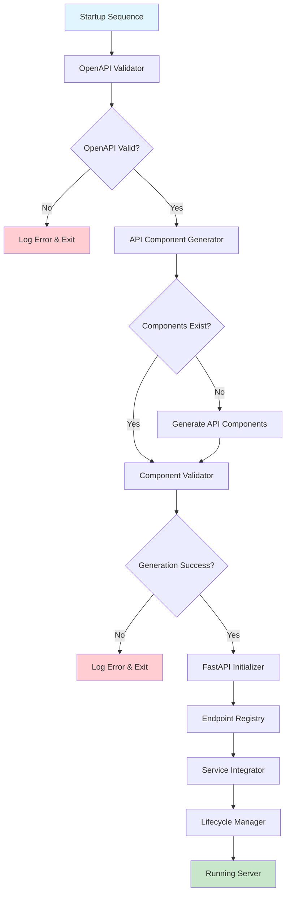
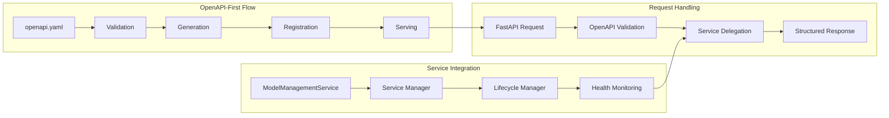
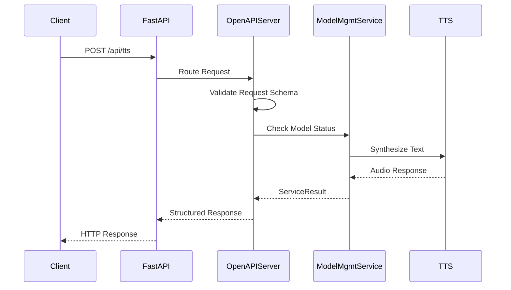

# Design Document

## Overview

The lightweight TTS API server is a streamlined, OpenAPI-first implementation that automatically generates and serves TTS endpoints without frontend components. This feature transforms the current comprehensive TTS server into a pure API service focused on programmatic access and developer integration.

The lightweight server eliminates frontend serving overhead, implements automatic OpenAPI component validation and generation, and provides comprehensive endpoint coverage while maintaining robust model management capabilities. It serves as a production-ready API gateway that democratizes TTS access through clean, well-documented REST APIs.

The system leverages the existing service-based architecture but introduces a specialized startup sequence that validates OpenAPI specifications, generates missing API components, and creates a FastAPI application with automatic endpoint registration. This approach ensures that the API behavior matches the documentation exactly while supporting automatic regeneration when specifications change.

## Steering Document Alignment

### Technical Standards (tech.md)

The design follows established technical patterns from tech.md:

- **FastAPI Framework**: Continues using FastAPI for modern async web framework with automatic documentation
- **Pydantic Validation**: Leverages Pydantic for data validation and API documentation generation
- **Async Processing**: Non-blocking synthesis operations using the existing async service architecture
- **Modular Design**: Maintains separation of concerns between API generation, model management, and synthesis
- **Type Safety**: Full type checking with comprehensive error handling patterns
- **Service Architecture**: Uses the established BaseService pattern for lifecycle management

### Project Structure (structure.md)

The implementation follows project organization conventions:

- **Server Module Location**: Components reside in `TTS/server/` following the established server structure
- **Service Pattern**: New services follow the `TTS/server/services/` organization pattern
- **Configuration Management**: Uses Coqpit-based configuration following `TTS/server/config.py` patterns
- **Naming Conventions**: Python modules use snake_case, classes use PascalCase
- **Error Handling**: Implements structured error responses using established ServiceResult patterns
- **Testing Organization**: Test files will follow the `tests/aux_tests/test_*.py` pattern

## Code Reuse Analysis

### Existing Components to Leverage

- **BaseService**: Foundation for all new service components with standardized lifecycle management
- **ServiceResult**: Established pattern for structured service operation results
- **ModelManagementService**: External dependency for all model operations and state management
- **ServerConfig/Coqpit**: Configuration system for OpenAPI server settings and validation
- **ServiceManager**: Orchestrates service dependencies and initialization
- **GlobalModelState**: Integration point for model state access and synthesis operations

### Integration Points

- **OpenAPI Specification**: Central source of truth at `TTS/server/openapi.yaml` for endpoint definitions
- **Model Management Integration**: Delegates all model operations to existing ModelManagementService
- **Configuration System**: Integrates with existing config.json structure for server settings
- **Service Architecture**: Plugs into the established service-based server framework
- **Error Handling**: Uses existing error handlers and ServiceResult patterns

## Architecture

The lightweight TTS API server implements an OpenAPI-first architecture with automatic component generation and validation. The system follows a four-phase startup sequence: validation, generation, initialization, and serving.







## Components and Interfaces

### OpenAPIValidator
- **Purpose:** Validates OpenAPI specification existence, syntax, and completeness during startup
- **Interfaces:** 
  - `validate_openapi_spec(spec_path: Path) -> ValidationResult`
  - `check_spec_completeness(spec: dict) -> List[ValidationIssue]`
- **Dependencies:** yaml parser, OpenAPI 3.0 schema validator
- **Reuses:** Existing logging infrastructure, ServiceResult patterns

### APIComponentGenerator  
- **Purpose:** Generates FastAPI models and endpoint handlers from OpenAPI specification when missing
- **Interfaces:**
  - `generate_models_from_spec(spec: dict) -> GenerationResult`
  - `generate_endpoint_handlers(spec: dict) -> List[EndpointHandler]`
  - `detect_component_changes(spec_path: Path) -> bool`
- **Dependencies:** openapi-generator-cli, file system operations
- **Reuses:** Path utilities, logging, error handling patterns

### EndpointRegistry
- **Purpose:** Automatically registers OpenAPI-defined endpoints with FastAPI application
- **Interfaces:**
  - `register_endpoints_from_spec(app: FastAPI, spec: dict) -> RegistrationResult`
  - `create_endpoint_handler(operation: dict) -> Callable`
  - `validate_endpoint_registration(app: FastAPI) -> ValidationResult`
- **Dependencies:** FastAPI, OpenAPI specification
- **Reuses:** Request/response validation patterns, error handling

### LightweightTTSServer
- **Purpose:** Main server class that orchestrates startup sequence and manages server lifecycle
- **Interfaces:**
  - `initialize(config: ServerConfig) -> ServiceResult`
  - `start_server(host: str, port: int) -> None`
  - `shutdown_gracefully() -> ServiceResult`
  - `get_server_status() -> ServerStatus`
- **Dependencies:** All other components, ModelManagementService
- **Reuses:** BaseService patterns, ServiceManager integration

### ServiceIntegrator
- **Purpose:** Bridges OpenAPI endpoints to ModelManagementService operations
- **Interfaces:**
  - `handle_tts_request(request: TTSRequest) -> ServiceResult`
  - `handle_model_operation(operation: ModelOperation) -> ServiceResult`
  - `handle_health_check() -> HealthStatus`
- **Dependencies:** ModelManagementService, request/response models
- **Reuses:** Service delegation patterns, ServiceResult structures

### LifecycleManager
- **Purpose:** Manages graceful startup and shutdown with proper resource cleanup
- **Interfaces:**
  - `execute_startup_sequence(config: ServerConfig) -> ServiceResult`
  - `execute_shutdown_sequence() -> ServiceResult`
  - `monitor_service_health() -> HealthStatus`
- **Dependencies:** All server components, signal handlers
- **Reuses:** BaseService lifecycle patterns, cleanup procedures

## Data Models

### OpenAPIServerConfig
```python
@dataclass
class OpenAPIServerConfig(Coqpit):
    # OpenAPI validation settings
    openapi_spec_path: str = "openapi.yaml"
    strict_validation: bool = True
    require_all_endpoints: bool = True
    
    # Component generation settings  
    auto_generate_missing: bool = True
    generation_timeout_seconds: int = 60
    force_regeneration: bool = False
    
    # Server behavior settings
    api_only_mode: bool = True
    enable_openapi_docs: bool = True
    enable_redoc_docs: bool = True
    cors_origins: List[str] = field(default_factory=list)
    
    # Service integration settings
    model_service_required: bool = True
    health_check_interval: int = 30
    graceful_shutdown_timeout: int = 30
```

### ValidationResult
```python
@dataclass
class ValidationResult:
    success: bool
    spec_valid: bool
    issues: List[ValidationIssue]
    spec_path: str
    validation_time: float
    openapi_version: Optional[str] = None
```

### GenerationResult
```python
@dataclass  
class GenerationResult:
    success: bool
    models_generated: bool
    endpoints_generated: bool
    generation_time: float
    output_directory: str
    generated_files: List[str]
    errors: List[str] = field(default_factory=list)
```

### ServerStatus
```python
@dataclass
class ServerStatus:
    running: bool
    startup_complete: bool
    endpoints_registered: int
    model_service_healthy: bool
    uptime_seconds: float
    last_health_check: datetime
    active_requests: int = 0
```

## Error Handling

### Error Scenarios

1. **OpenAPI Specification Missing/Invalid**
   - **Handling:** Validator logs detailed error messages specifying missing file path or validation failures, server exits with code 1
   - **User Impact:** Clear error message indicating OpenAPI spec location and specific validation failures, preventing server startup

2. **Component Generation Failure**
   - **Handling:** Generator logs specific generation errors, attempts fallback to existing components if available, continues with reduced functionality
   - **User Impact:** Warning message about missing functionality, server may start with limited endpoint coverage

3. **Endpoint Registration Failure**
   - **Handling:** Registry logs failed endpoint details, continues registering other endpoints, provides summary of successful/failed registrations
   - **User Impact:** Some API endpoints may be unavailable, health check reports registration status

4. **ModelManagementService Unavailable**
   - **Handling:** Service integrator returns HTTP 503 for model-dependent endpoints, continues serving non-model endpoints, implements circuit breaker pattern
   - **User Impact:** TTS synthesis unavailable with clear error message, other endpoints (health, docs) remain functional

5. **Request Validation Failure**
   - **Handling:** FastAPI automatic validation returns HTTP 422 with detailed field-level validation errors matching OpenAPI schema
   - **User Impact:** Clear validation error messages indicating specific parameter issues and expected formats

6. **Runtime Service Errors**
   - **Handling:** Structured error logging with request correlation IDs, graceful error responses, health status degradation reporting
   - **User Impact:** Consistent error response format, service status visibility through health endpoints

## Testing Strategy

### Unit Testing
- **OpenAPIValidator**: Test spec validation with valid/invalid YAML files, schema compliance checking, error message accuracy
- **APIComponentGenerator**: Test generation with various OpenAPI specs, file creation verification, error handling for missing dependencies
- **EndpointRegistry**: Test endpoint registration with mock FastAPI apps, parameter mapping validation, error handling
- **ServiceIntegrator**: Test service delegation with mock ModelManagementService, request/response transformation, error propagation
- **LifecycleManager**: Test startup/shutdown sequences, signal handling, resource cleanup verification

### Integration Testing
- **End-to-End Server Startup**: Test complete startup sequence from OpenAPI validation through server ready state
- **OpenAPI-to-Endpoint Flow**: Test that generated endpoints match OpenAPI specification exactly, including request/response schemas
- **Service Integration**: Test integration with real ModelManagementService, model loading, synthesis operations
- **Error Recovery**: Test graceful degradation when services fail, partial functionality scenarios
- **Configuration Variations**: Test different server configurations, API-only mode, documentation serving

### End-to-End Testing
- **API Client Testing**: Generate API clients from OpenAPI spec and test against running server
- **Documentation Verification**: Test that /docs and /redoc serve complete interactive documentation
- **Production Scenarios**: Test high-load scenarios, concurrent requests, memory management
- **Deployment Testing**: Test containerized deployment, environment variable configuration, health monitoring
- **OpenAPI Compliance**: Validate that server responses exactly match OpenAPI specification schemas